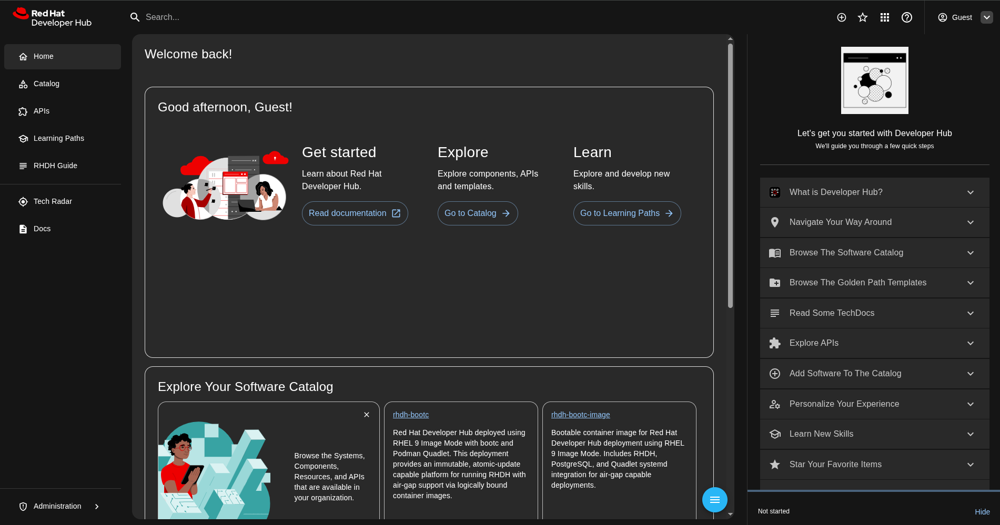

# RHDH bootc + Quadlet (image mode)

Red Hat Developer Hub deployed as a RHEL 9 bootc image with Podman Quadlet services.

## Quick Start

### 1. Authenticate

```bash
# Registry credentials (for pulling RHDH/PostgreSQL images)
podman login registry.redhat.io

# RHEL packages (Fedora/non-RHEL hosts only)
sudo subscription-manager register
```

### 2. Build

```bash
./build.sh
```

The script auto-detects your registry credentials from `~/.config/containers/auth.json` and copies them to `files/auth.json` for the build. If the auto-detection fails, copy manually:

```bash
cp ~/.config/containers/auth.json files/auth.json
```

### 3. Run

```bash
# Remove any previous test container
podman rm -f rhdh-bootc-test 2>/dev/null

# Start the bootc image with systemd (--privileged), exposing RHDH (7007) and PostgreSQL (5432)
podman run -d --name rhdh-bootc-test --privileged -p 7007:7007 -p 5432:5432 localhost/rhdh-bootc:latest
```

First start takes ~2 minutes (plugin installation), you can verify services during this time. 

### 4. Open

The container auto-detects its IP address and configures RHDH accordingly. To find the correct URL:

```bash
podman exec rhdh-bootc-test grep '^BASE_URL' /etc/rhdh/rhdh.env
```

Example output: `BASE_URL=http://172.20.10.2:7007` open that URL in your browser and log in as **Guest**.


---

## Verify Services

```bash
# Service status
podman exec rhdh-bootc-test systemctl status postgres.service rhdh.service --no-pager

# RHDH logs
podman exec rhdh-bootc-test journalctl -u rhdh.service -f

# Health check
podman exec rhdh-bootc-test /usr/local/bin/health-check.sh
```

Both `postgres.service` and `rhdh.service` should show `Active: active (running)`.

---

## Customization

### Runtime (no rebuild)

Edit environment variables in `quadlet/rhdh.env` on the running host:

- `BASE_URL` / `EXTERNAL_URL` — application URL
- `GITHUB_TOKEN` / `GITLAB_TOKEN` — SCM integration
- `POSTGRES_PASSWORD` — database credential
- Branding colors: `PRIMARY_LIGHT_COLOR`, `HEADER_LIGHT_COLOR_1`, etc.

### Build-time (requires rebuild)

Copy the example override files, edit them, then run `./build.sh`:

```bash
# Dynamic plugins
cp configs/dynamic-plugins/dynamic-plugins.override.example.yaml \
   configs/dynamic-plugins/dynamic-plugins.override.yaml

# Catalog users and groups
cp configs/catalog-entities/users.override.example.yaml \
   configs/catalog-entities/users.override.yaml

# Catalog components
cp configs/catalog-entities/components.override.example.yaml \
   configs/catalog-entities/components.override.yaml
```

App configuration layers (highest to lowest priority):

1. `configs/app-config/app-config.local.yaml` (your local overrides, gitignored)
2. `configs/app-config/app-config.production.yaml` (day-2 ops)
3. `app-config.patched.yaml` (auto-generated integrations)
4. `configs/app-config/app-config.yaml` (base defaults, read-only)

### BASE_URL

Defaults to `http://localhost:7007`. To override, set `EXTERNAL_URL` in `quadlet/rhdh.env`:

```bash
EXTERNAL_URL=auto                              # auto-detect VM/cloud IP
EXTERNAL_URL=https://rhdh.apps.example.com     # specific URL (OpenShift/proxy)
```

---

## Access & Credentials

| Service    | User    | Default                              | Notes                          |
|------------|---------|--------------------------------------|--------------------------------|
| SSH        | admin   | (locked — provide SSH keys via cloud-init) | wheel group, sudo access |
| PostgreSQL | postgres| `CHANGE_ME_POSTGRES_ADMIN_PASSWORD`  | set in `postgres.env` and `rhdh.env` |
| PostgreSQL | rhdh_user| `CHANGE_ME_RHDH_DB_PASSWORD`        | database: `rhdh_backstage`     |
| RHDH       | Guest   | (none)                               | dev environment only           |

**All `CHANGE_ME_*` values must be replaced before deployment.**

---

## Registry Credentials

The build embeds `files/auth.json` into the image so Quadlet can pull images at runtime and for air-gapped bootc-image-builder flows.

`files/auth.json` is gitignored. Refresh before each build if pulls fail:

```bash
podman login registry.redhat.io
rm files/auth.json
./build.sh
```

**Production**: Mount credentials at runtime instead of embedding:
```bash
podman run -v /run/secrets/auth.json:/etc/containers/auth.json:ro ...
```

---

## Project Structure

| Path | Description |
|------|-------------|
| `Containerfile.bootc` | Image definition |
| `build.sh` | Build script |
| `configs/app-config/` | RHDH app configuration |
| `configs/dynamic-plugins/` | Plugin configuration |
| `configs/catalog-entities/` | Users, groups, components, TechDocs |
| `quadlet/` | Systemd Quadlet units (rhdh, postgres, network) and env files |
| `scripts/` | Plugin prep, startup, base URL detection, postgres grants |
| `files/` | Runtime files embedded in image (auth.json) |

---

## Air-Gap / Pre-Pulled Images

Container images are pre-pulled during build into `/usr/lib/containers/storage` and registered via `additionalimagestores` in `storage.conf`. This means podman finds images locally at runtime without needing registry access.

Verify available images:
```bash
podman exec rhdh-bootc-test podman images
```

For VM deployment, `bootc-image-builder` embeds these images into the final QCOW2/ISO.

---

## Troubleshooting

### Build fails with 403 on DNF repos

Your subscription may have expired or your consumer profile was deleted:

```bash
sudo subscription-manager identity
# If deleted: unregister and re-register
sudo subscription-manager unregister
sudo subscription-manager register
sudo subscription-manager status
```

### Build fails with "insufficient UIDs"

The build uses nested podman (podman pull inside podman build). The `build.sh` already passes `--cap-add SYS_ADMIN --security-opt label=disable` to handle this. If it still fails, check that your user has subordinate ID ranges:

```bash
grep $USER /etc/subuid /etc/subgid
```

### CORS errors / can't reach RHDH

CORS only allows requests from the `BASE_URL` origin. Check what it's set to:

```bash
podman exec rhdh-bootc-test grep '^BASE_URL' /etc/rhdh/rhdh.env
```

Use the URL shown there. If you set `EXTERNAL_URL=auto`, BASE_URL will be an IP — use that instead of `localhost`.

### Services not starting

```bash
podman exec rhdh-bootc-test journalctl -u rhdh.service --no-pager
podman exec rhdh-bootc-test journalctl -u postgres.service --no-pager
```
