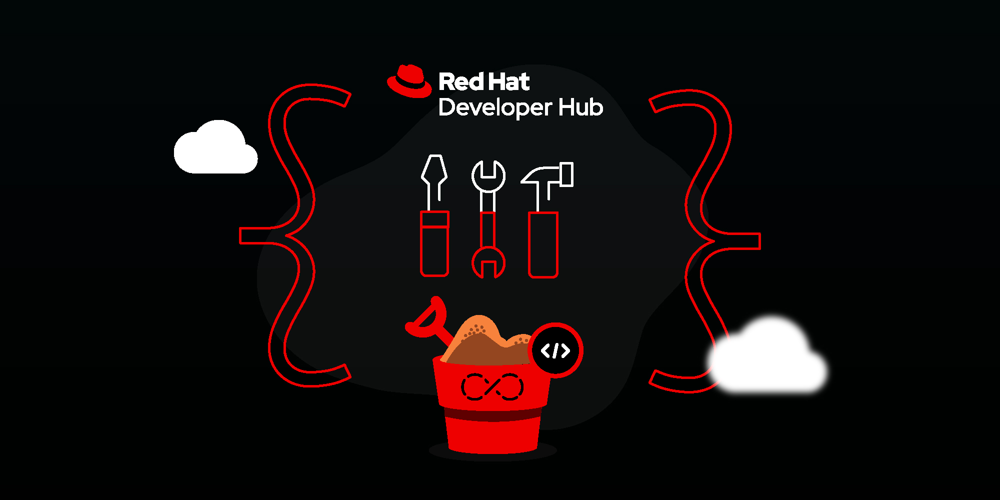

{ width="850" }

# RHDH bootc Deployment

This Red Hat Developer Hub instance is deployed using RHEL 9 Image Mode with bootc and Podman Quadlet.

## Architecture Overview

This deployment uses:

- **RHEL 9 bootc** - Image-based operating system for atomic updates and rollbacks
- **Podman Quadlet** - Container management via systemd for native service integration
- **Logically Bound Images** - Container images embedded in disk image for air-gap support
- **PostgreSQL** - Containerized database with persistent storage
- **Dynamic Plugins** - Runtime plugin installation and configuration

## Documentation

### Image Mode and bootc
- [RHEL 9 Image Mode Documentation](https://docs.redhat.com/en/documentation/red_hat_enterprise_linux/9/html/using_image_mode_for_rhel_to_build_deploy_and_manage_operating_systems/introducing-image-mode-for-rhel_using-image-mode-for-rhel-to-build-deploy-and-manage-operating-systems#additional_resources)
- [bootc Project Documentation](https://bootc.dev/bootc/intro.html)

### Container Management
- [Podman Quadlet Documentation](https://docs.podman.io/en/latest/markdown/podman-quadlet.1.html)

### Red Hat Developer Hub
- [RHDH Product Documentation](https://docs.redhat.com/en/documentation/red_hat_developer_hub/)
- [RHDH Plugins](https://developers.redhat.com/rhdh/plugins)

## Deployment Resources

See the README.md and ARCHITECTURE.md files in this repository for:

- Build and deployment instructions
- Service architecture and dependencies
- Configuration options
- Air-gap deployment guidance
- Troubleshooting procedures

*[RHDH]: Red Hat Developer Hub
*[bootc]: Boot Container - image-based OS technology
