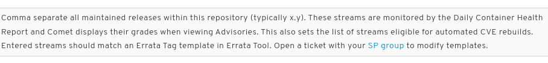
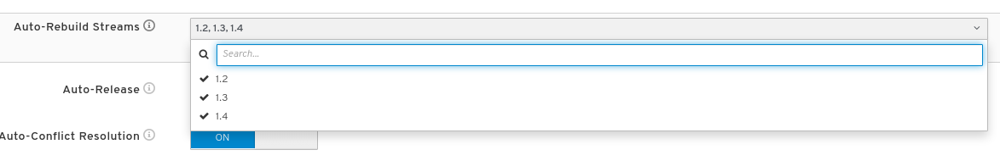
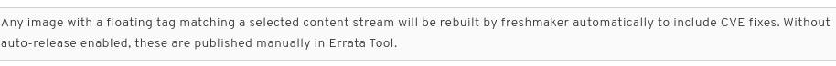

 # Release Guide

This document seeks to explain the whole end-to-end process for releasing RHDH, from branch creation to GA push.

_TODO_: Think about how best to create a release guide (gantt chart, smartsheet, etc.)

## Code Freeze / Blockers Only / New Stream Day

Creation of brew targets and errata PV can be done any time before starting the feature/code frozen builds from the new 1.y branch, but it's better to do it in advance so your builds don't fail due to the missing brew target / PV.

Once set up, you can then run the branch creation script whenever dev is done (or nearly done) it's time for feature.

Once the branches are created, expect a flurry of last minute cherrypicks and requests for "can I include this non-blocker item too?" :this-is-fine: :this-is-the-way:

**Reject those requests** and send them to PM/QE/Doc for approval as these should have already landed in the LOCKED test/doc plan weeks ago.

### Brew Targets, Product Variants, and CPEs

. Request new Brew Targets & product variant (PV) be created via link:https://issues.redhat.com/browse/SPMM-17463[SPMM ticket like SPMM-17463] and by pinging @ahills / @siege on slack

. Once the associated Errata PV is created, ProdSec gets notified and adds the appropriate CPE within a day or two. For questions, ping Martin Prpič or link:https://docs.engineering.redhat.com/pages/viewpage.action?spaceKey=PRODSEC&title=CPE[send an email] to prodsec-request@redhat.com.

### Create branches (eg., release-1.4, release-1.5)

Use the link:../build/scripts/tagRelease.sh[tagRelease.sh] script like this:
```
# to create release-1.4 + rhdh-1.4-rhel-9 branches, then update main + rhdh-1-rhel-9 branches
export GITHUB_TOKEN=<your_GH_token>
./build/scripts/tagRelease.sh -t 1.4 --branchfrom main -gh release-1.4
```

Script will create/update 1.y branches and update the main + rhdh-1-rhel-9 branches with minor version bumps for the GH and GL repos.

NOTE that downstream branch creation can also be done  manually, if the tagRelease.sh script can't handle it due to timeouts.

```
for repo in hub operator operator-bundle; do
  cd /tmp
  # check out the pkgs.devel repo
  git clone ssh://nboldt@pkgs.devel.redhat.com/containers/rhdh-$repo && cd rhdh-$repo
  # get latest commits from 1.next branch
  git checkout rhdh-1-rhel-9; git pull origin rhdh-1-rhel-9 
  # create 1.4 branch
  git branch rhdh-1.4-rhel-9; git checkout rhdh-1.4-rhel-9
  # push new branch - NOTE: this might fail and need to be retried a few times
  git push origin rhdh-1.4-rhel-9
  cd /tmp
done
```

NOTE: **_TODO_ https://issues.redhat.com/browse/RHIDP-931 verify branch creation and update steps work**

. Create 6 Github branches - run link:../build/scripts/tagRelease.sh[tagRelease.sh] 

.. [ ] https://github.com/janus-idp/backstage-plugins/branches/all?query=1.&lastTab=overview
.. [ ] https://github.com/janus-idp/backstage-showcase/branches/all?query=1.&lastTab=overview
.. [ ] https://github.com/redhat-developer/rhdh-operator/branches/all?query=1.&lastTab=overview

.. [ ] https://github.com/redhat-developer/red-hat-developers-documentation-rhdh/branches/all?query=1.&lastTab=overview
.. [ ] https://github.com/redhat-developer/rhdh-chart/branches/all?query=1.&lastTab=overview
.. [ ] https://github.com/redhat-developer/red-hat-developer-hub-software-templates/branches/all?query=1.&lastTab=overview

. Create 1 Gitlab branch - run link:../build/scripts/tagRelease.sh[tagRelease.sh] 

.. [ ] https://gitlab.cee.redhat.com/rhidp/rhdh/-/tree/rhdh-1.y-rhel-9 (from the rhdh-1-rhel-9 branch)

. Create 3 new branches in pkgs.devel MANUALLY (tagRelease.sh doesn't work for this due to timeouts)

.. [ ] https://pkgs.devel.redhat.com/cgit/containers/rhdh-hub/tree/?h=rhdh-1.4-rhel-9
.. [ ] https://pkgs.devel.redhat.com/cgit/containers/rhdh-operator/tree/?h=rhdh-1.4-rhel-9
.. [ ] https://pkgs.devel.redhat.com/cgit/containers/rhdh-operator-bundle/tree/?h=rhdh-1.4-rhel-9

### Update main branch versions

NOTE: **_TODO_ https://issues.redhat.com/browse/RHIDP-931 verify branch creation and update steps work**

Bump versions in upstream main branches - run link:../build/scripts/tagRelease.sh[tagRelease.sh] 

. [ ] janus-idp/backstage-plugins (_TODO_: migrate to link:https://github.com/backstage/community-plugins[backstage/community-plugins])
.. [ ] Bump all non-private plugin & package package.json files to new version 1.y+1 - see link:../build/scripts/checkPluginVersions.sh[checkPluginVersions.sh] (called from link:../build/scripts/tagRelease.sh[tagRelease.sh])

. [ ] janus-idp/backstage-showcase (**_TODO_: migrate to link:https://issues.redhat.com/browse/RHIDP-1022[rhdh]**)
.. [ ] Bump link:https://github.com/janus-idp/backstage-showcase/blob/main/package.json#L3[package.json] and e2e-tests/package.json to new 1.y+1 version
.. [ ] Verify https://github.com/janus-idp/backstage-showcase/blob/main/packages/app/src/build-metadata.json is correct (both Backstage and RHDH versions)

. [ ] redhat-developer/rhdh-operator
.. [ ] Bump versions to 0.y+1 upstream and 1.y+1 downstream (link:https://github.com/redhat-developer/rhdh-operator/tree/main/.rhdh[.rhdh folder]):
... [ ] Makefile
... [ ] bundle/manifests/backstage-operator.clusterserviceversion.yaml
... [ ] config/manager/kustomization.yaml
... [ ] .rhdh/bundle/manifests/rhdh-operator.clusterserviceversion.yaml

NOTE: Dockerfile version metadata downstream is derived from the backstage-showcase package.json version.

### Update rhdh-1.yy-rhel-9 branch versions

NOTE: **_TODO_ https://issues.redhat.com/browse/RHIDP-931 verify branch creation and update steps work**

Submit PR (or just merge change) to fix version reference in `upstream_repos.yml` for the new rhdh-1.yy-rhel-9 branch; trigger a build from the new branch.

### Trigger respins, 1.4 and newer (RH Internal Konflux)

. This process is still evolving but the overview is that you need a set of tekton pipelines, a Release, Release Plan, and Release Plan Admission for each new 1.y version of RHDH that will be released to the RHEC as a GA build.

Existing applications:

* https://konflux.apps.stone-prod-p02.hjvn.p1.openshiftapps.com/application-pipeline/workspaces/rhdh/applications/rhdh-1/activity (for CI builds only, cannot be released as GA)
* https://konflux.apps.stone-prod-p02.hjvn.p1.openshiftapps.com/application-pipeline/workspaces/rhdh/applications/rhdh-1-3/activity (not currently working)

Existing tekton pipelines for builds and FBCs: 

* link:../.tekton/README.adoc[.tekton/README.adoc]
* link:../.tekton[.tekton]

Existing FBC catalog content:

* link:../catalogs[catalogs]
* link:../build/scripts/renderCatalogs.sh[renderCatalogs] (replacement for link:../build/scripts/copyIIBsToQuay.sh[copyIIBsToQuay], used for OSBS IIB builds)

See also link:RHDH-konflux.adoc[RHDH-konflux.adoc]

Since the midstream transformation still requires a GL pipeline to trigger Konflux, you still need a new pipeline for 1.4. See next step.

### Trigger respins, 1.4 and earlier (OSBS)

. **FOR 1.3 and earlier** Create new gitlab pipeline schedule for stable branch 1.4 (to run in parallel with CI builds from 1.next)

. Run pipelines from
.. https://gitlab.cee.redhat.com/rhidp/rhdh/-/pipeline_schedules or 
.. https://gitlab.cee.redhat.com/rhidp/rhdh/-/pipeline (by committing to the branches)

. You can also force a respin using this script: link:../build/scripts/triggerRespin.sh[build/scripts/triggerRespin.sh]

. If you need to release a plugin manually from the stable branch (not main) see link:../build/scripts/releasePlugin.sh[build/scripts/releasePlugin.sh]
+
[IMPORTANT]
====
Once the above build is done, you will need to update the **Catalog Sources** (also known as index bundles or IIBs) published on Quay if you want to use the simple catalog source installation scripts.

Run the copy to quay script:

```
./copyIIBsToQuay.sh -p -t 1.4 --latest
./copyIIBsToQuay.sh -p -t 1.5 --next
```

You should see new tags added here:

https://quay.io/repository/rhdh/iib?tab=tags

If the script fails with an error like this, try again in an hour or two:
```
[ERROR] Could not fetch ref_url from https://resultsdb-api.engineering.redhat.com/api/v2.0/results/latest?testcases=cvp.redhat.detailed.operator-catalog-initialization-bundle-image&item=rhdh-operator-bundle-container-1.5-30
```
====
+
. Verify that after moving to 1.5 in main, we have:
.. 1.4 == latest
.. 1.5 == next

... [ ] https://quay.io/repository/rhdh/rhdh-hub-rhel9?tab=tags
... [ ] https://quay.io/repository/rhdh/rhdh-rhel9-operator?tab=tags
... [ ] https://quay.io/repository/rhdh/rhdh-operator-bundle?tab=tags
... [ ] https://quay.io/repository/rhdh/iib?tab=tags

. Perform install smoke tests
.. helm chart from https://github.com/rhdh-bot/openshift-helm-charts/tree/rhdh-1-rhel-9/installation#installation and https://github.com/rhdh-bot/openshift-helm-charts/tree/rhdh-1.4-rhel-9/installation#installation
.. operator install from https://gitlab.cee.redhat.com/rhidp/rhdh/-/blob/rhdh-1-rhel-9/build/scripts/installCatalogSourceFromIIB.sh for `--latest` and `--next`
+
[WARNING]
====
If the changes you expect are not seen when installing via Operator, but are seen via Helm, re-run the `copyIIBsToQuay.sh` script again (see **IMPORTANT** note above) and check if there's a newer catalog source (index bundle) available. It can take several hours for a completed operator-bundle build to produce a matching IIB build for all the supported OCP versions, so you may have to try again a few times.
====
+
. Push the latest images into the errata in progress

. Verify CHI grades from the Container page; if needed, update to a newer base image or explicitly install patched RPMs, and respin 

## Release Candidates

Once the code freeze is achieved and all the last minute changes have stopped, you need to :

* disable the 1.y pipeline so you don't get any unexpected/unapproved changes in the release candidate
** log in as the rhdh-bot, then go to the link:https://gitlab.cee.redhat.com/rhidp/rhdh/-/pipeline_schedules[pipeline schedules] page
** find the correct pipeline, efg., for 1.3 use https://gitlab.cee.redhat.com/rhidp/rhdh/-/pipeline_schedules/1804/edit?id=1804
** uncheck the *Activated* box, and hit *Save changes*

* copy the latest IIBs to quay.io/rhdh/iib
** wait until the CVP tests are completed and the IIB is fully published and has passed its tests
** run `copyIIBsToQuay.sh` to update the IIBs for the RC, using an additional RC flag to ensure your IIBs persist longer than 14 days
+
```
TAG=1.3-95
STREAM=1.3
EXTRA_TAG="-e 1.3.0.RC-09-26"
./copyIIBsToQuay.sh -p -t ${TAG} --latest ${EXTRA_TAG}
```
+
** verify the IIB is correct:
+
```
./checkImagesInIIB.sh -y -q quay.io/rhdh/iib:${STREAM}-v4.14-x86_64 && \
for q in $(./getLatestImageTags.sh -b rhdh-${STREAM}-rhel-9 --quay); do echo;echo $q; \
  skopeo inspect docker://$q | jq -r '.Env[] | select(.|test("_REPO=")?)'; \
done; \
sudo rm -fr /tmp/opm-registry-* \
    /tmp/quay.io-rhdh-iib-* \
    /tmp/registry-proxy.engineering.redhat.com-rh-osbs-rhdh-rhdh-operator-bundle-*; \
```
+
* update the errata with the latst RC builds
** copy the latest NVRs into the errata
+
```
./getLatestImageTags.sh -b rhdh-1.3-rhel-9 --errata 123456errata-number-goes-here789
```
+
** move the errata to `QE` and trigger a push to stage

* smoke test the helm and operator installation on clusterbot (4.14 or newer, gcp)

* send notification
** collect the NVRs and quay images into an email and send it to QE with a subject like `RHDH 1.3.0 RC-09-26 is ready for QE`
** copy the contents of that email into slack #forum-rhdh-releases channel

If a second RC build is needed, re-enable the scheduled pipeline (or trigger a pipeline manually), and repeat the above steps. 

## During GA week

. Push errata to stage for QE review

. **Remind docs team** that they must review/approve the errata, and help them with version bumps and release notes content.
.. Check for existing Release Notes and Dynamic Plugins table PRs against the link:https://github.com/redhat-developer/red-hat-developers-documentation-rhdh/[RHDH Docs repo].
.. Run the following scripts to update existing pending RN/plugins table PRs, or to inform creation of new one(s).
... https://github.com/redhat-developer/red-hat-developers-documentation-rhdh/blob/main/modules/dynamic-plugins/rhdh-supported-plugins.sh
... https://github.com/redhat-developer/red-hat-developers-documentation-rhdh/blob/main/modules/release-notes/single-source-fixed-security-issues.sh
... https://github.com/redhat-developer/red-hat-developers-documentation-rhdh/blob/main/modules/release-notes/single-source-release-notes.py
.. If changes are found, submit PR (s) or update existing in-progress PRs. Examples:
... https://github.com/redhat-developer/red-hat-developers-documentation-rhdh/pull/592 (1.2.5 RN + plugin version updates)
... https://github.com/redhat-developer/red-hat-developers-documentation-rhdh/pull/643 (1.3.1 RN + plugin version updates)


. For a .0 GA release, collect GO/NO-GO votes from stakeholders
..  _TODO_: Collect list of owners from various stakeholders (Linda's Go/No-Go list)
.. For .z updates, this is generally not needed. 

. **Remind QE** to move the errata to REL_PREP **ONLY WHEN ALL TESTS ARE DONE**
.. GA push will go out automatically via Release Driver

. **Remind PM** to update https://developers.redhat.com/rhdh/plugins with latest plugin lists and link to the docs (https://docs.redhat.com/en/documentation/red_hat_developer_hub/1.3)

## On GA Day

### [WAIT] Initial setup 
. [ ] QE will announce the errata has been moved to `REL_PREP` in slack.

. [ ] Launch a clusterbot instance for smoke testing. This will take about 45 mins to create.

. [ ] Monitor container image release via errata.

### [RELEASE] Once images are live

. [ ] Remove the now-EOL image stream from Comet so we stop getting reminded about CVEs for EOL versions. For example with the release of 1.4, 1.2 will be EOL. See image metadata at https://comet.engineering.redhat.com/containers/repositories?view=myRepos&filter=repoPath:rhdh then click through on each image to edit them.
+
image::images/comet-config.png[]



+
. [ ] link:../build/helm/prepare.sh[Push the helm chart].
+
```
# log in as the bot
git config --global user.name "rhdh-bot service account"
git config --global user.email "rhdh-bot@redhat.com"
export GITHUB_TOKEN=ghp_***** 
gh auth status

# create pull request
./build/helm/prepare.sh --chart-version 1.4.2 --rhdh-version 1.4-132 --chart-branch release-1.4 --catalog git@github.com:rhdh-bot/openshift-helm-charts.git --publish
```
+
You should see something like this:
+
```
Create chart for 1.4-132 (1.4.2)
Set image digests in charts/backstage/values.yaml: 
* RHDH_DIGEST = 9709e056f194a24c809dd82b4ab10aa05a9c31574e68ae8d1a5e91de19237045, 
* POSTGRESQL_DIGEST = f1f581d8974799f17d4707f9161b2d0568a07255e535ca3be3b36ce254b091a4
...
Chart version:        1.4.2
Developer Hub image:  registry.redhat.io/rhdh/rhdh-hub-rhel9:1.4-132
Branch:               https://github.com/rhdh-bot/openshift-helm-charts/tree/redhat-developer-hub-1.4.2
...
[release-1.4.2 daf0844] chore: chart: add Red Hat Developer 1.4.2 for registry.redhat.io/rhdh/rhdh-hub-rhel9:1.4-132
...
https://github.com/openshift-helm-charts/charts/pull/1556
```
+
. [ ] link:../build/scripts/copyIIBsToQuay.sh[Release the operator IIB to Quay] so it doesn't expire.
+
```
cd /tmp; git clone git@gitlab.cee.redhat.com:rhidp/rhdh.git --depth 1 && cd rhdh

# use tag from https://quay.io/repository/rhdh/rhdh-operator-bundle?tab=tags
./build/scripts/copyIIBsToQuay.sh -t 1.4-121 --force --push --latest -e 1.4.2.GA
```

. [ ] link:../build/scripts/tagRelease.sh[Tag the repos listed above]
+
```
cd /tmp; git clone git@gitlab.cee.redhat.com:rhidp/rhdh.git --depth 1 && cd rhdh

./build/scripts/tagRelease.sh -v 1.4.2 -t 1.4 -gh release-1.4 -pd rhdh-1.4-rhel-9 -ghtoken $GITHUB_TOKEN

```

### [TEST] Once images, chart, and tags are available

. Smoke tests using clusterbot
.. [ ] Operator: smoke test the ability to:
... [ ] install from `fast` - see link:https://github.com/redhat-developer/rhdh-operator/blob/main/.rhdh/docs/installing-ci-builds.adoc[installation]
... [ ] switch to `fast-1.4` or `fast-1.5` subscription channel
... [ ] verify update from of 1.4.0 -> 1.4.1 (or 1.5.0)
.. [ ] Helm Chart: smoke test the ability
... [ ] install latest chart
... [ ] upgrade to a newer chart - see link:https://github.com/rhdh-bot/openshift-helm-charts/tree/rhdh-1-rhel-9/installation[installation]


. Review websites
.. Developers.redhat.com
.. Access.redhat.com (docs, other)
.. Customer portal

. Check in with marketing re:
.. Internal announcement? External announcement? Other marketing / blogs / videos? Summit alignment / presentations?

## Other considerations

Ongoing through the quarter, remember to:

. Update the link:../build/dockerfiles/[gitlab pipeline runner images] at least once every quarter
. Monitor GH-GL syncs and pipelines, as things can fail unexpectedly in OSBS or on gitlab runners
. Monitor quay image updates to ensure everything is kept current and fresh relative to upstream branches
. Monitor new OCP release dates - add a new Application and Component for the new FBC in Konflux - see link:RHDH-konflux.adoc[RHDH-konflux]
. Monitor OCP EOL dates - delete old FBC Applications from Konflux to stop building for that OCP version - see link:RHDH-konflux.adoc[RHDH-konflux]

## Summary of Release tasks:

### For a z-stream update, first do this

- collect the fixes in janus plugins + community plugins, and verifying that they've been released to npmjs.com
- collect the updated plugin versions into showcase, and verifying a downstream build has succeeded

### For all builds (y and z-stream)

- add builds to the errata, verify CVP tests have passed, then push the errata to stage
- coordinate with QE and Doc via slack and email notifications of RC builds and progress of testing, doc readiness, etc.
- remind QE to move the errata to {{REL_PREP; }}watch while the builds are pushed (1-2 hrs?); complain on slack in various rel-eng channels if things break while pushing or ask siege for help

### Once the containers have shipped 

- generate the helm chart PR for the openshift helm charts repo; monitor until it's merged
- smoke test the operator and helm installs
- notify Docs that they can release the latest RN updates
- tag the repos w/ the new 1.2.5 tag; bumping the repos to 1.2.6 in case we do another z update
- remove EOL versions of RHD from Comet - see details above
- notify Prod Sec of EOL version - see https://issues.redhat.com/browse/PSSECDEV-7737
