= Release Guide for RHDH

This document outlines the complete end-to-end process for releasing RHDH, covering everything from branch creation to the GA push. It is tailored for a Linux/amd64 environment. 

[[prepare-os-arm64]]
[NOTE]
====
[🍎 macOS_arm64]
Be sure to run link:../build/scripts/prepareOSXARM64.sh[prepareOSXARM64.sh] beforehand to install required tools and set up environment.
====

---

[IMPORTANT]
====
**Before creating a new stable branch, or preparing an RC :**

* [ ] Check for open PRs from `rhdh-bot` related to repo version bumps, base image updates, or RPM lock file updates: link:https://github.com/redhat-developer/rhdh/pulls?q=is%3Aopen+is%3Apr+author%3Arhdh-bot[RHDH], link:https://github.com/redhat-developer/rhdh-local/pulls?q=is%3Aopen+is%3Apr+author%3Arhdh-bot[RHDH Local], link:https://github.com/redhat-developer/rhdh-chart/pulls?q=is%3Aopen+is%3Apr+author%3Arhdh-bot[RHDH Chart], link:https://github.com/redhat-developer/rhdh-operator/pulls?q=is%3Aopen+is%3Apr+author%3Arhdh-bot[RHDH Operator]
* [ ] Review and merge them immediately (force merge if necessary after sanity check)
* [ ] Ensure no pending PRs are left behind for the relevant branch (main if branching, release-1.y if spinning up an RC)
* [ ] Ensure base images and RPM locks are as up to date as possible. 

**NOTE:** Part of doing the release is ensuring these are merged in a timely manner. Either re-run tests (if you feel there's value), or force merge if you don't (generally for these bot-generated PRs, unless there's an obvious typo, they can be force merged after a quick visual inspection / sanity check).

See <<post-ga-follow-up,Post-GA follow-up>> for the concrete consequences and what to verify after tagging.
====

== Feature Freeze / New Stream Day

Feature freeze is typically declared by the Release Manager. Do not create branches until RM confirms we're ready. 

Once the Release Manager gives the "green light," you can proceed with branching.

Run the branch creation script (link:../build/scripts/tagRelease.sh[tagRelease.sh]) when the Release Manager has confirmed it's time for feature freeze.

Once the branches are created, expect a flurry of last minute cherrypicks and requests for "can I include this non-blocker item too?" 

**Reject those requests** and send them to RM/PM/Doc for approval as these should have already landed in the LOCKED test/doc plan weeks ago.
[[ocp-version-support]]
=== Does this new release add or remove support for OCP versions?

If so, be sure to add a new (or remove an EOL) FBC application from link:https://gitlab.cee.redhat.com/releng/konflux-release-data/-/tree/main/tenants-config/cluster/stone-prod-p02/tenants/rhdh-tenant/fbc?ref_type=heads/rhdh-tenant/fbc[rhdh-tenant/fbc]. Once merged you should see changes under link:https://konflux-ui.apps.stone-prod-p02.hjvn.p1.openshiftapps.com/ns/rhdh-tenant/applications[application], link:https://konflux-ui.apps.stone-prod-p02.hjvn.p1.openshiftapps.com/ns/rhdh-tenant/applications/fbc-4-20/components[component] and link:https://konflux-ui.apps.stone-prod-p02.hjvn.p1.openshiftapps.com/ns/rhdh-tenant/release[RP] + link:https://konflux-ui.apps.stone-prod-p02.hjvn.p1.openshiftapps.com/ns/rhdh-tenant/release/release-plan-admission[RPA]. These are all controlled from the  https://gitlab.cee.redhat.com/releng/konflux-release-data[konflux-release-data Pipelines As Code repo]. When a 1.y stream goes end of life, you can remove old RPs, RPAs, and the application and its components. 

Also, remember to update the link:../build/scripts/ocp-versions.yaml[ocp-versions.yaml] file to add/remove OCP versions. 

For example:

* link:https://gitlab.cee.redhat.com/releng/konflux-release-data/-/merge_requests/9018[add FBC application]
* link:https://gitlab.cee.redhat.com/releng/konflux-release-data/-/merge_requests/9491[add FBC release plan and admission]

=== Create branches (`release-1.y`, `rhdh-1.y-rhel-9`) + onboard new Product Security definition, Konflux application & components, and pyxis configuration

Use the link:../build/scripts/tagRelease.sh[tagRelease.sh] script like this:

[source,bash]
----
# Create '1.y' branches 
# - 'release-1.y' branch (https://github.com/redhat-developer/rhdh/tree/release-1.y)
# - 'rhdh-1.y-rhel-9' branch (https://gitlab.cee.redhat.com/rhidp/rhdh/-/tree/rhdh-1.y-rhel-9)
#
# then update 
# - 'main' branch (https://github.com/redhat-developer/rhdh/tree/main)
# - 'rhdh-1-rhel-9' branch (https://gitlab.cee.redhat.com/rhidp/rhdh/-/tree/rhdh-1-rhel-9)

# Get <rhdh_bot_GH_token> from Vault (https://vault.bitwarden.com/#/vault?organizationId=cd864c42-0667-4521-afb0-aae600ef844c)

export GITHUB_TOKEN=<rhdh_bot_GH_token>
  ./build/scripts/tagRelease.sh --help
----

Script will create/update `1.y` branches in both GH and GL repos, then update the link:https://github.com/redhat-developer/rhdh/tree/main[main] and link:https://gitlab.cee.redhat.com/rhidp/rhdh/-/tree/rhdh-1-rhel-9[rhdh-1-rhel-9] branches with minor version bumps.

Details:

. After link:../build/scripts/tagRelease.sh[tagRelease.sh] runs, 5 GitHub branches(`release-1.y`) and 2 GitLab branches (`rhdh-1.y-rhel-9`) are created/updated.

.. link:https://github.com/redhat-developer/rhdh/branches/all?query=1.&lastTab=overview[https://github.com/redhat-developer/rhdh]
.. link:https://github.com/redhat-developer/rhdh-operator/branches/all?query=1.&lastTab=overview[https://github.com/redhat-developer/rhdh-operator]
.. link:https://github.com/redhat-developer/red-hat-developers-documentation-rhdh/branches/all?query=1.&lastTab=overview[https://github.com/redhat-developer/red-hat-developers-documentation-rhdh]
.. link:https://github.com/redhat-developer/rhdh-chart/branches/all?query=1.&lastTab=overview[https://github.com/redhat-developer/rhdh-chart]
.. link:https://github.com/redhat-developer/red-hat-developer-hub-software-templates/branches/all?query=1.&lastTab=overview[https://github.com/redhat-developer/red-hat-developer-hub-software-templates]

.. link:https://gitlab.cee.redhat.com/rhidp/rhdh/-/branches[https://gitlab.cee.redhat.com/rhidp/rhdh/-/branches]
.. link:https://gitlab.cee.redhat.com/rhidp/rhdh-plugin-catalog/-/branches[https://gitlab.cee.redhat.com/rhidp/rhdh-plugin-catalog/-/branches]

  
. Also, version bumps in upstream `main` branches are created via link:../build/scripts/tagRelease.sh[tagRelease.sh].

.. link:https://github.com/redhat-developer/rhdh/pull/3127/files[redhat-developer/rhdh]
... Bump link:https://github.com/redhat-developer/rhdh/blob/main/package.json#L3[package.json], link:https://github.com/redhat-developer/rhdh/blob/main/e2e-tests/package.json[e2e-tests/package.json] and link:https://github.com/redhat-developer/rhdh/blob/main/dynamic-plugins/package.json[dynamic-plugins/package.json] to new `1.y+1` versions
... Verify https://github.com/redhat-developer/rhdh/blob/main/packages/app/src/build-metadata.json is correct (both Backstage and RHDH versions)

.. link:https://github.com/redhat-developer/rhdh-operator[redhat-developer/rhdh-operator]
... Bump versions to `0.y+1` upstream and `1.y+1` downstream 
... **NOTE**: wait for generated PR to be refreshed by rhdh-operator GH actions before merging! If your PR changes, then there's a bug in the tagRelease.sh which is causing changes that the rhdh-operator repo doesn't want. Review the difference and update tagRelease.sh accordingly.

. Merge generated MRs for the new `rhdh-1.y-rhel-9` branch

. Update the following repositories:

.. link:https://gitlab.cee.redhat.com/prodsec/product-definitions[Product Security] (to add new RHDH versions)
.. link:https://gitlab.cee.redhat.com/releng/pyxis-repo-configs[Pyxis repo configs] (to add new plugin repos for the catalog)
.. link:https://gitlab.cee.redhat.com/releng/konflux-release-data[Konflux release data] to add new link:https://konflux-ui.apps.stone-prod-p02.hjvn.p1.openshiftapps.com/ns/rhdh-tenant/release/release-plan-admission[RPAs], link:https://konflux-ui.apps.stone-prod-p02.hjvn.p1.openshiftapps.com/ns/rhdh-tenant/release[RPs], and link:https://konflux-ui.apps.stone-prod-p02.hjvn.p1.openshiftapps.com/ns/rhdh-tenant/applications[Applications] (including new plugin catalog builders and plugins).

NOTE: link:../build/scripts/tagRelease.sh[tagRelease.sh] should generate MRs for all three repos mentioned above, including adding new plugins with: link:https://gitlab.cee.redhat.com/rhidp/rhdh-plugin-catalog/-/blob/rhdh-1-rhel-9/build/scripts/generatePyxisConfigForPlugins.sh[generatePyxisConfigForPlugins.sh] and link:https://gitlab.cee.redhat.com/rhidp/rhdh-plugin-catalog/-/blob/rhdh-1-rhel-9/build/scripts/generateKonfluxReleaseDataForPlugins.sh[generateKonfluxReleaseDataForPlugins.sh]. 

NOTE: Merge requests **WILL FAIL** if there are required changes to either of their dependent repos (eg., cannot update konflux-release-data if the CPE(Common Platform Enumeration) isn't present).

For reference, here are the PRs and MRs for the `1.8` branch creation:

* https://github.com/redhat-developer/rhdh/pull/3544
* https://github.com/redhat-developer/rhdh-cli/pull/35
* https://github.com/redhat-developer/rhdh-operator/pull/1733
* https://github.com/redhat-developer/rhdh/pull/3546
* https://gitlab.cee.redhat.com/rhidp/rhdh/-/commit/b28643458, 4e9baa24e, and 1ee76b9a7
* https://gitlab.cee.redhat.com/releng/pyxis-repo-configs/-/merge_requests/323
* https://gitlab.cee.redhat.com/prodsec/product-definitions/-/merge_requests/3943
* https://gitlab.cee.redhat.com/releng/konflux-release-data/-/merge_requests/11184

== Create new GL pipeline

As the 'rhdh-bot@redhat.com' user, go to link:https://gitlab.cee.redhat.com/rhidp/rhdh/-/pipeline_schedules[pipeline schedules] and create (or repurpose) a new pipeline for the `1.y` branch, then point it at the recently created `rhdh-1.y-rhel-9` branch. 

You should never need more than 4 pipelines:

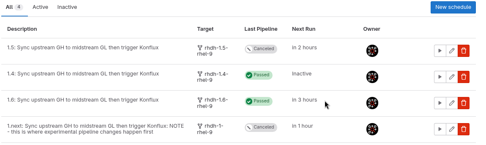

Make sure that the pipeline's `Activated` checkbox is enabled. Save your changes. 

=== Trigger respins

Once everything above is merged, trigger some builds!

To manually re-trigger builds without changes to the upstream see: link:RHDH-FAQ.adoc#user-content-how-to-respin[FAQ - How to respin].

You need:

* link:../.tekton/[tekton pipelines] (2 per container image, 1 per FBC for each supported OCP version), 
* link:https://gitlab.cee.redhat.com/releng/konflux-release-data/-/tree/main/tenants-config/cluster/stone-prod-p02/tenants/rhdh-tenant[an Application + Components], 
* link:https://gitlab.cee.redhat.com/releng/konflux-release-data/-/tree/main/tenants-config/cluster/stone-prod-p02/tenants/rhdh-tenant/release-plans[Release Plans(RPs)] for stage and prod, 
* link:https://gitlab.cee.redhat.com/releng/konflux-release-data/-/tree/main/config/stone-prod-p02.hjvn.p1/product/ReleasePlanAdmission/rhdh[Release Plan Admissions(RPAs)] for stage and prod, 
* link:https://gitlab.cee.redhat.com/releng/konflux-release-data/-/blob/main/config/stone-prod-p02.hjvn.p1/product/EnterpriseContractPolicy/registry-rhdh-stage.yaml[Conforma for stage] and link:https://gitlab.cee.redhat.com/releng/konflux-release-data/-/blob/main/config/stone-prod-p02.hjvn.p1/product/EnterpriseContractPolicy/registry-rhdh-prod.yaml[Conforma for prod] (Conforma is the new name for Enterprise Contract Policy(ECP))
+
** for each new `1.y` version of RHDH that will be released to the RHEC(Red Hat Ecosystem Catalog - Red Hat's official container registry for production releases) as a GA build. Creating all this is handled by the link:../build/scripts/tagRelease.sh[tagRelease.sh] script. 

Applications:

* https://konflux-ui.apps.stone-prod-p02.hjvn.p1.openshiftapps.com/ns/rhdh-tenant/applications/rhdh-1/activity (for CI builds only, cannot be released as GA)
* https://konflux-ui.apps.stone-prod-p02.hjvn.p1.openshiftapps.com/ns/rhdh-tenant/applications/rhdh-1-y/activity (for `1.y` builds)

FBC catalog content:

* link:../catalogs[catalogs]
** link:../build/scripts/renderCatalogs.sh[renderCatalogs.sh] (to rebuild the catalog to include any new GA releases and the latest CI build for testing)

See also link:RHDH-Konflux-overview-onboarding.adoc[RHDH-Konflux-overview-onboarding.adoc]

Since the midstream transformation still requires a GL pipeline to trigger Konflux, you still need a new pipeline for `1.y`. See next step.

[IMPORTANT]
====
Once the above build is done, you will need to update the **Catalog Sources** on Quay if you want to use the link:https://github.com/redhat-developer/rhdh-operator/blob/main/.rhdh/scripts/install-rhdh-catalog-source.sh[catalog source installation script].

Run the link:../build/scripts/renderCatalogs.sh[renderCatalogs.sh] script to get usage instructions

You may need to adjust the catalog template to replace any invalid values or replacements that don't make sense. 

For example if releasing `1.y.z` after `1.(y-1).z`, the script output may attempt to make the lower version a replacement for higher version, instead of the other way around. 

This is easily rectified with a manual update to the link:../catalogs/v4.16/catalog-template.json['catalog-template.json']; then run the script again using the '--template' flag to use a template instead of generating one (which would overwrite your customized changes).

You should see new tags added here:

https://quay.io/repository/rhdh/iib?tab=tags

You can now install from an FBC using link:https://github.com/redhat-developer/rhdh-operator/blob/main/.rhdh/scripts/install-rhdh-catalog-source.sh[install-rhdh-catalog-source.sh]. This adds a catalog source for a CI build to an OCP cluster, and optionally also installs a susbcription. Once that's on the cluster, you can create a Backstage/RHDH instance from the operator. 
====

. After moving to 1.yy in main and rebuilding from the 1.next application in konflux, verify the following tags in the Quay repositories have moved:
* `1.yy` == `latest`;  `1.yy+1` == `next`
* https://quay.io/repository/rhdh/rhdh-hub-rhel9?tab=tags
* https://quay.io/repository/rhdh/rhdh-rhel9-operator?tab=tags
* https://quay.io/repository/rhdh/rhdh-operator-bundle?tab=tags
* https://quay.io/repository/rhdh/iib?tab=tags
. Perform install smoke tests
..  link:https://github.com/rhdh-bot/openshift-helm-charts/tree/rhdh-1-rhel-9/installation#installation[helm chart install instruction] 
.. operator install by using https://github.com/redhat-developer/rhdh-operator/blob/main/.rhdh/scripts/install-rhdh-catalog-source.sh for `-v 1.y` or `--latest` or `--next`
+
[WARNING]
====
If the changes you expect are not seen when installing via Operator, but are seen via Helm, re-run the link:../build/scripts/renderCatalogs.sh[renderCatalogs.sh] script to pull in the latest CI build for the current branch.
====

== Create plugin pipelines

This process is still evolving and subject to change. Once we have a stable process for building plugins and the catalog index, onboarding + building the plugins will need to happen BEFORE the operator bundle build.

See link:https://gitlab.cee.redhat.com/rhidp/rhdh-plugin-catalog/-/blob/rhdh-1-rhel-9/docs/RELEASE_GUIDE.adoc[rhdh-plugin-catalog/docs/RELEASE_GUIDE.adoc]

== Release Candidates

=== Container base images 

Before declaring RC, you should make sure we've updated to the latest base images and RPMs. The link:https://gitlab.cee.redhat.com/rhidp/rhdh/-/blob/rhdh-1-rhel-9/build/scripts/updateBaseImages.sh[updateBaseImages.sh] script can be used for this if you don't want to deal with Renovate or Mintmaker pull requests. The script will check for new base images, commit one change per update, and attempt to push directly to the repo; if you can't do so, a pull request will be generated instead.

Users can manually run a base image update from link:https://gitlab.cee.redhat.com/rhidp/rhdh/-/pipeline_schedules[GitLab Pipeline Schedules] - first click the button to "take ownership" of the weekly maintenance task, then click the "run scheduled pipeline" to trigger a run. If you then refresh the page, you can click on the running pipeline.

----
# choose the correct branch
git clone -b release-1.y git@github.com:redhat-developer/rhdh.git
cd rhdh
/path/to/gl/rhidp/rhdh/build/scripts/updateBaseImages.sh -b release-1.y -w $(pwd) -f \*ockerfile -maxdepth 5

# choose the correct branch
git clone -b release-1.y git@github.com:redhat-developer/rhdh-operator.git
cd rhdh-operator
/path/to/gl/rhidp/rhdh/build/scripts/updateBaseImages.sh -b release-1.y -w $(pwd) -f \*ockerfile -maxdepth 5

# NOTE: If you don't have the required privileges to commit directly to the `rhdh` and `rhdh-operator` repos, you may use the `-n` option to preview without committing the change(dryrun), or use the `--pr` option to create a pull request instead, then merge the PR manually.
----

=== RPM lockfiles

For RPMs, we should already be on the latest pinned values because of changes in the upstream RHDH repo:
* https://github.com/redhat-developer/rhdh/pulls?q=is%3Apr+author%3Arhdh-bot+is%3Aclosed+%22update+RPM%22

However the link:https://github.com/redhat-developer/rhdh-operator[RHDH Operator] repo does not currently benefit from this automation; as such you need to update the various branches manually. 

Downstream, updating to the latest should be handled by the link:https://gitlab.cee.redhat.com/rhidp/rhdh/-/blob/rhdh-1-rhel-9/build/ci/sync-midstream.sh?ref_type=heads#L1114-1131[build/ci/sync-midstream.sh] script, but in case it's not, you can run this snippet to check for newer RPMs:

----
git clone -b release-1.y git@github.com:redhat-developer/rhdh.git
cd rhdh
for d in distgit/containers/rhdh-hub distgit/containers/rhdh-operator; do
  pushd $d >/dev/null || exit 1
    if [[ $d == "distgit/containers/rhdh-hub" ]] || [[ $d == "distgit/containers/rhdh-operator" ]]; then
      if [[ -f rpms.in.yaml ]] && [[ -f rpms.lock.yaml ]]; then
        if [[ ! -x "${HOME}/.local/bin/rpm-lockfile-prototype" ]]; then 
          echo "Install rpm-lockfile-prototype ... "
          time sudo dnf -q -y install python3 python3-pip python3-dnf
          mkdir -p "${HOME}/.local/bin/"
          time python3 -m pip install --user https://github.com/konflux-ci/rpm-lockfile-prototype/archive/refs/heads/main.zip
          export PATH=${PATH%":${HOME}/.local/bin"}:${HOME}/.local/bin
        fi
        echo -e "${green}[INFO] Regen $d/rpms.lock.yaml from Containerfile + rpms.in.yaml using $(which rpm-lockfile-prototype) in [$(pwd)] ${norm}"
        time "${HOME}/.local/bin/rpm-lockfile-prototype" -f Containerfile rpms.in.yaml # >/dev/null 2>&1 
      fi
    fi
  popd >/dev/null || exit 1
done
----

Commit your changes. This should avoid seeing Container Health Index (CHI) values lower than A in the link:https://catalog.redhat.com/en/search?searchType=Containers&q=rhdh%2Frhdh&p=1[Red Hat Ecosystem Catalog].

You can also check CHI values in Comet:

* link:https://comet.engineering.redhat.com/containers/repositories/645bd4c15c00598369c31aba[hub]
* link:https://comet.engineering.redhat.com/containers/repositories/64bfdcd740aa90644e579cbd[operator]
* link:https://comet.engineering.redhat.com/containers/repositories/64bfdcd740aa90644e579cc6[bundle]

=== Konflux pipeline tekton tasks

Before declaring RC, you should make sure we're updated to the latest tekton tasks. Run link:../.tekton/updateDigests.sh[updateDigests.sh] to update tekton tasks in pipelines. You can use the `--minor` flag to update from 0.y to 0.y+1, but bear in mind you may need to follow the migration steps to adjust the pipeline yaml after changing to the new tag version.

=== Does this new release add or remove support for OCP versions?
See the <<ocp-version-support,OCP version support section>> for details on version compatibility changes.

=== Spinning up the RC

[NOTE]
.RC CHECKLIST
====
Before starting RC work, ensure:

* [ ] Bot-generated PRs are merged/triaged for the release branch (see checklist above)
* [ ] RC maintenance updates are complete
** [ ] base images in GH repos
** [ ] RPM lockfiles in GH repos
** [ ] Tekton task tags & digests in GL repos
* [ ] Pipeline schedule for the RC in progress should be disabled **AFTER the RC build is ready**
====

Once the code freeze is achieved and all the last minute changes have stopped, you need to:

. disable the `1.y` link:https://gitlab.cee.redhat.com/rhidp/rhdh/-/pipeline_schedules[pipeline] so you don't get any unexpected/unapproved changes in the release candidate
** This step is to avoid confusion between "latest build" and "the build you want for the RC"; you can still use `--snapshot` flags to select an older link:https://konflux-ui.apps.stone-prod-p02.hjvn.p1.openshiftapps.com/ns/rhdh-tenant/applications/rhdh-1-y/snapshots[*snapshot*], but this is cleaner and safer.
** log in as rhdh-bot@redhat.com, then go to the link:https://gitlab.cee.redhat.com/rhidp/rhdh/-/pipeline_schedules[pipeline schedules] page
** find the correct pipeline, eg., '1.8: Sync upstream...'' 
** uncheck the *Activated* box, and hit *Save changes*

. To rebuild the hub and operator images, you can use the link:../build/scripts/triggerRespin.sh[`triggerRespin.sh`] script to trigger a GL pipeline to fetch upstream changes and apply them to the midstream. If nothing has changed, use the `-k` flag to trigger a Konflux respin. You should monitor Konflux and Quay to verify new builds are created correctly. See also link:RHDH-FAQ.adoc#user-content-how-to-respin[FAQ - How to respin].
+
----
# choose the correct branch
git checkout rhdh-1.y-rhel-9
# rebuild in GL then if changes found, in Konflux too
./build/scripts/triggerRespin.sh -v 1.y hub,op 
or
# rebuild in Konflux only
./build/scripts/triggerRespin.sh -v 1.y hub -k 
----
+
NOTE: It may take up to 50 minutes for the new images to be available. You can monitor the progress in https://quay.io/repository/rhdh/rhdh-hub-rhel9?tab=tags and https://quay.io/repository/rhdh/rhdh-rhel9-operator?tab=tags.
+
. GL pipelines will link:../build/ci/sync-midstream.sh#L663[automatically respin] the link:../build/ci/update-bundle-and-FBCs.sh[bundle] (and FBC builds) if a new hub or operator image is found in quay.io/rhdh. 
.. Optionally, to *_manually_* create a new operator-bundle, do this (latest or next flag will be computed automatically):
+
----
# choose the correct branch
git checkout rhdh-1.y-rhel-9
./build/scripts/triggerRespin.sh -v 1.y bun

[INFO] Transform /home/nboldt/RHDH/DH/4/4-rhdh_18/distgit/containers/rhdh-operator-bundle/manifests/backstage-operator.clusterserviceversion.yaml ...
         Compute digest for quay.io/rhdh/rhdh-hub-rhel9:1.y ...
       * quay.io/rhdh/rhdh-hub-rhel9@sha256:2ec112051b0ab65798ef7557fdc7d4632eb5f41ecc9038f20949399793cd289e (quay.io/rhdh/rhdh-hub-rhel9:1.y-zzz)
         Compute digest for quay.io/rhdh/rhdh-rhel9-operator:1.y ...
       * quay.io/rhdh/rhdh-rhel9-operator@sha256:b3cb23948f40f37f5e3336013a6e553feaf19cea1b203b7d7d966c239c128d2b (quay.io/rhdh/rhdh-rhel9-operator:1.y-zzz)
         Compute digest for registry.redhat.io/rhdh/rhdh-rhel9-operator:1.y ...
       * quay.io/rhdh/rhdh-rhel9-operator@sha256:b3cb23948f40f37f5e3336013a6e553feaf19cea1b203b7d7d966c239c128d2b (quay.io/rhdh/rhdh-rhel9-operator:1.y-zzz)
         Compute digest for registry.redhat.io/rhel9/postgresql-15:latest ...
       * registry.redhat.io/rhel9/postgresql-15@sha256:e776cae7d62baab3525be7e2596f45007affd44244379a8be53a431e3a794f34 (registry.redhat.io/rhel9/postgresql-15:1-1745921148)
...
[rhdh-1-rhel-9 57b5e5337] [ci skip] Bundle Update Only:  rhdh-operator from: https://github.com/redhat-developer/rhdh-operator/tree/main @ 868c0a08; rhdh-operator-bundle from: https://github.com/redhat-developer/rhdh-operator/tree/main @ 868c0a08;
----
+
[IMPORTANT]
====
Make sure that there is an `.sbom` and `.src` tags matching each of your containers (link:https://issues.redhat.com/browse/RHIDP-6564[RHIDP-6564]). It will have the same SHA in its name as the SHA of your tagged image.

For example if the SHA for `quay.io/rhdh/rhdh-hub-rhel9:1.5-182` starts with `8519350b69c6` search for that digest to find a matching `sha256-8519350b69c677fcbc0068b9bfbccfa4a827c85dc4d3b3619250b74db0ab3c67.sbom` and `sha256-8519350b69c677fcbc0068b9bfbccfa4a827c85dc4d3b3619250b74db0ab3c67.src` tags:

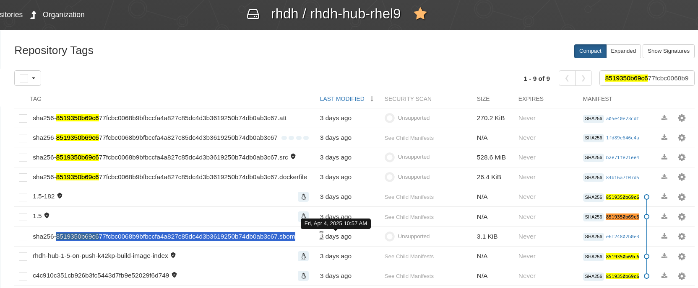
====
+
. GL pipelines will link:../build/ci/sync-midstream.sh#L663[automatically respin] the link:../build/ci/update-bundle-and-FBCs.sh[FBC builds] (along with a new bundle) if a new hub or operator image is found in quay.io/rhdh. 

.. Optionally, to *_manually_* publish new FBCs to link:https://quay.io/repository/rhdh/iib[quay.io/rhdh/iib], use the link:../build/scripts/renderCatalogs.sh[renderCatalogs.sh] script. *Run the script from the correct `rhdh-1.y-rhel-9` branch*, and it will provide usage intructions you can then copy into the console. Latest or next flag will be added automatically if appropriate. Rendering, committing changes, and running builds for each OCP version should take no more than 20-30 mins.
+
----
# choose the correct branch
git checkout rhdh-1.y-rhel-9
./build/scripts/renderCatalogs.sh --default ...
----

. Verify the bundle and FBC content is correct - check that the image contains the SAME images as the latest ones; also use the list of branches/commits to verify that all expected commits have been built:
+
----
RHDH_VERSION=1.y
OCP_VERSION=4.18
sudo ./build/scripts/checkRCStatus.sh -v ${RHDH_VERSION} -o ${OCP_VERSION}
----
+
Sample output:
+
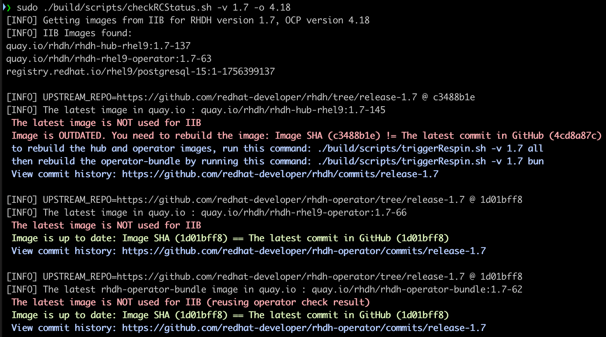
+
. Release containers to Stage for any RCs using link:../build/scripts/kfuxRelease.sh[kfuxRelease.sh]
+
----
# choose the correct branch
git checkout rhdh-1.y-rhel-9

./build/scripts/kfuxRelease.sh -c help

# use the CVE list file you exported from the RHDH CVE Management tracker above
# with list of JIRAs to close (recommended), and snapshot override (if needed)
./build/scripts/kfuxRelease.sh --stage -v 1.y.z -c rhdh-operator-bundle:1.y-zzz \
    --cve ~/tmp/cve_csv_exports/1.y/RHDH\ CVE\ Management\ -\ 1.y.z.csv  \
    --issues RHDHPLAN-234,RHIDP-8047,RHIDP-8057 \
    [--debug] [--snapshot rhdh-1-y-abcdef]
----
+
[NOTE]
====
* confirm that no link:https://spaces.redhat.com/pages/viewpage.action?pageId=87729676&spaceKey=SP&title=Pipeline%2BTemperature[release freeze is in effect and the pipeline is not frozen] before running the script.
* before running the script, verify the list of OCP versions supported in the link:../build/scripts/ocp-versions.yaml[ocp-versions.yaml] file.
* ensure if CVE list found from link:https://docs.google.com/spreadsheets/d/1JZVTc03wirx-bTpjn3muWed8cGyFTRTNe6x3Gr02hys/edit?gid=973768917#gid=973768917[RHDH CVE Management tracker] are `Release Pending`.
* **FBCs** are not supported on the RHEC Stage instance link:https://gitlab.cee.redhat.com/releng/konflux-release-data/-/merge_requests/3947[if the production policy is in effect]. See link:https://redhat-internal.slack.com/archives/C06RBUP0M2Q/p1737051256060019[this thread]. Because of this, there is no value in trying to push FBCs to stage prior to GA day. 
====
+
. **IMPORTANT!** Once run, perform the following checks before announcing this RC is ready:
+
*Check CHI grades in Comet for images you have pushed to stage.* If you see anything lower than A, investigate and fix base images, RPM lock files, or fixable CVEs.
+
* https://comet.stage.engineering.redhat.com/containers/repositories/645be66cb272ea332e3abd62 (hub)
* https://comet.stage.engineering.redhat.com/containers/repositories/64bff10ca2cf791704ccb4c6 (operator)
* https://comet.stage.engineering.redhat.com/containers/repositories/64bff10da2cf791704ccb4cf (operator-bundle)
+
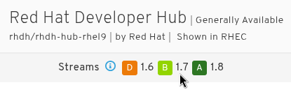
+
*Additional manual verification (do not rely on automation alone):*
+
* *Verify base image and RPM updates.* Do not trust base image or RPM automation blindly; confirm the changes (e.g. in the operator repo) to avoid regressions. See link:https://github.com/redhat-developer/rhdh-operator/pull/2337[this example] of the kind of issue that can slip through, that is, only having ONE base image updated to the latest RHEL version.
* *Confirm zero CVEs in Konflux.* In the Konflux UI, verify that the builds report a zero count of CVEs.
+
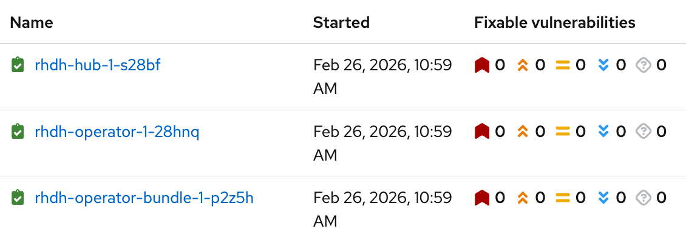
+
* *Review Konflux clair-scan for fixable CVEs.* Summary icons on the clair-scan task run details page shows fixable CVE status.
+
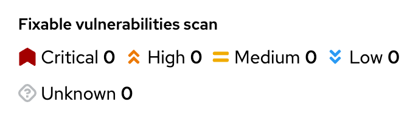
+
* *If FBC publishing is blocked in Konflux,* defer fixes and publishing until the next business day rather than rushing; avoid last-minute changes that can introduce new issues.
+
. If a second RC build is needed, you can re-run the GL pipeline *_manually_* from the link:https://gitlab.cee.redhat.com/rhidp/rhdh/-/pipeline_schedules[pipeline_schedules] page, if you don't want to re-enable it. Note that you'll have to manually run the pipeline TWICE - first to pick up new commits for hub and operator builds, then a second time for bundle and FBC builds.
+
. Notify team via slack and email - see next section for details.

=== Release Candidates Notifications

Once the RC images are created (containers and FBCs), *notify the following people* via the following methods:

. Slack channel: link:https://app.slack.com/client/E030G10V24F/C07EVRDD7KN[forum-rhdh-releases] - use the link:https://gitlab.cee.redhat.com/rhidp/rhdh/-/blob/rhdh-1-rhel-9/build/scripts/sendSlackNotifications.sh[sendSlackNotifications.sh] script 
+
----
./build/scripts/sendSlackNotifications.sh --version 1.y.z --bundle-tag 1.y-zzz --slack-webhook <slack-webhook-url> --release-state RC [optional: --dryrun]
----
+
. Email the following people (dev/productization, testing, security, docs, and manangement) a link to the slack message as FYI
+
----
TO:

Gustavo Lira e Silva <glira@redhat.com>, rhdh-backstage-qe@redhat.com

CC:

Nick Boldt <nboldt@redhat.com>,
Joseph Kim <joskim@redhat.com>,
Martin Polasko <mpolasko@redhat.com>,

Kim Tsao <ktsao@redhat.com>
Fabrice Flore-Thébault <ffloreth@redhat.com>,
Kavya Verma <kavverma@redhat.com>,

Pavol Srna <psrna@redhat.com>,
Jasper Chui <jchui@redhat.com>,
Linda Sharar <lsharar@redhat.com>,
Christophe Fargette <jfargett@redhat.com>
----

== During GA week

. **Remind engineering and docs teams** that they must provide updated RN content. Help them with version bumps and release notes content.
.. Check for existing Release Notes and Dynamic Plugins table PRs against the link:https://github.com/redhat-developer/red-hat-developers-documentation-rhdh/[RHDH Docs repo].
.. Run the following scripts to update existing pending RN/plugins table PRs, or to inform creation of new one(s).
... https://github.com/redhat-developer/red-hat-developers-documentation-rhdh/blob/main/modules/dynamic-plugins/rhdh-supported-plugins.sh
... https://github.com/redhat-developer/red-hat-developers-documentation-rhdh/blob/main/modules/release-notes/single-source-release-notes.py
**** Check the list of versions on the release-pages:
      ***** link:https://issues.redhat.com/projects/RHIDP?selectedItem=com.atlassian.jira.jira-projects-plugin%3Arelease-page&status=released-unreleased[RHIDP]
      ***** link:https://issues.redhat.com/projects/RHDHBUGS?selectedItem=com.atlassian.jira.jira-projects-plugin%3Arelease-page&status=released-unreleased[RHDHBUGS]
     Versions must be in **sequential order** or else the fixversion/affectsversion fields in queries won't work with the `>` and `<` operators and you may end up with **NO ISSUES FOUND**.
.. If changes are found, create a PR with updates. To update only the dynamic plugins table, use this action:
*** https://github.com/redhat-developer/red-hat-developers-documentation-rhdh/actions/workflows/generate-supported-plugins-pr.yml

. For a `.0` GA release, collect GO/NO-GO votes from stakeholders
..  _TODO_: Collect list of owners from various stakeholders (Linda's Go/No-Go list)
.. For `.z` updates, this is generally not needed. 

. **Remind QE** to announce when they're done testing and have approved the release for production. This might be as little as JIRA updates or a slack message. 
.. GA push will then be pushed manually using link:../build/scripts/kfuxRelease.sh[kfuxRelease.sh].

. **Remind PM** to update https://developers.redhat.com/rhdh/plugins with latest plugin lists and link to the docs (https://docs.redhat.com/en/documentation/red_hat_developer_hub/1.y)

== On GA Day

=== [WAIT] Initial setup 
. QE will announce the release has passed and is ready for release in slack.

. Launch a link:https://app.slack.com/client/E030G10V24F/D03GXSUT32A[clusterbot] instance for smoke testing. This will take about 45 mins to create.

=== [BEGIN] Start the _container image_ release (15-20 mins)

. Export the link:https://docs.google.com/spreadsheets/d/1JZVTc03wirx-bTpjn3muWed8cGyFTRTNe6x3Gr02hys/edit?gid=973768917#gid=973768917[RHDH CVE Management tracker] from the correct sheet for the release you're about to do (eg., 1.y.z) using File > Download > Comma Separated Values (.csv). Save to a file such as `"/tmp/RHDH CVE Management - 1.y.z.csv"`

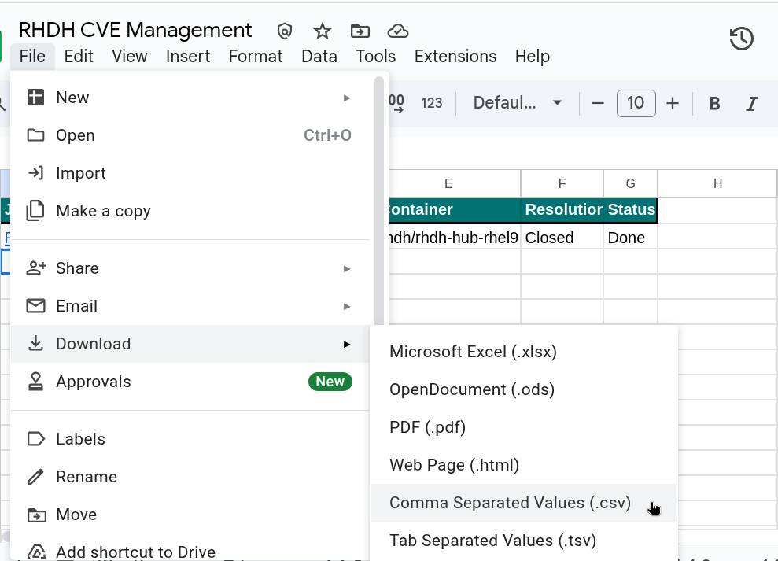

. Trigger the Konflux release for the container images to RHEC.
** When creating the Release CR yaml, include the **list of CVEs**, and 
** the `1.y.z` Test Plan and release Feature and Epic JIRAs, plus any noteworthy fixes you want mentioned in advisory.
** Konflux will add a link to the RHSA or RHBA link in each JIRA. 
+
----
# choose the correct branch
git checkout rhdh-1.y-rhel-9

./build/scripts/kfuxRelease.sh -c help

# use the CVE list file you exported from the RHDH CVE Management tracker above
# with list of JIRAs to close (auto-closes JIRAs and provides RHSA link), and snapshot override (if needed)
./build/scripts/kfuxRelease.sh --prod -v 1.y.z -c rhdh-operator-bundle:1.y-zzz \
    --cve ~/tmp/cve_csv_exports/1.y/RHDH\ CVE\ Management\ -\ 1.y.z.csv  \
    --issues RHIDP-6469,RHIDP-6937,RHIDP-6470 \
    --snapshot rhdh-1-y-abcde
----
. Monitor container image release using links provided by link:../build/scripts/kfuxRelease.sh[kfuxRelease.sh]. Release can be seen from link:https://konflux-ui.apps.stone-prod-p02.hjvn.p1.openshiftapps.com/ns/rhdh-tenant/applications/rhdh-1-y/releases/[rhdh-1-y/releases] and should be done in 15-20 mins, depending on network traffic. 

NOTE: To get access to the rhtap-releng namespace to watch managed pipelines, see https://konflux.pages.redhat.com/docs/users/releasing/preparing-for-release.html#_get_access_to_the_rhtap_releng_managed_workspace

=== [RELEASE] Once the _container images_ are live

==== Collect RHSA link for Release Notes

. Release notes should be updated with a link to the latest RHBA or RHSA advisory.

====
* The process for getting the link is a work in progress.

** If your RHSA included JIRAs, you can simply open one of those JIRAs to see the link to the RHSA
*** https://issues.redhat.com/browse/RHIDP-8806?focusedId=28128589&page=com.atlassian.jira.plugin.system.issuetabpanels:comment-tabpanel#comment-28128589

** Alternatively, data is available at https://gitlab.cee.redhat.com/releng/advisories/-/tree/main/data/advisories/rhdh-tenant

** Or, find the rhdh-hub-rhel9 container image in RHEC, choose the tag you want, and click the Security tab to find the advisory:
*** 1.6.2: https://catalog.redhat.com/software/containers/rhdh/rhdh-hub-rhel9/645bd4c15c00598369c31aba?image=68629c00516df09321576900 => https://access.redhat.com/errata/RHSA-2025:9966

* Once you have the RHSA link, submit a new PR or amend an existing one in flight to add a link into `modules/release-notes/ref-release-notes-fixed-security-issues.adoc` - here's an example:
** https://github.com/redhat-developer/red-hat-developers-documentation-rhdh/pull/1415/commits

* In future this may be done automatically. TODO: https://issues.redhat.com/browse/RHIDP-7886
====

==== FBC re-render (15 mins)

. Re-render the FBC catalogs with link:https://gitlab.cee.redhat.com/rhidp/rhdh/-/blob/rhdh-1-rhel-9/build/scripts/renderCatalogs.sh#L66[`renderCatalogs.sh --rhec`], to switch to `registry.redhat.io/rhdh` instead of `quay.io/rhdh` image references. This should take about 2 mins per OCP version, and the builds in Konflux should take 5-10 mins total. Whole step should be under 15 mins. 
+
----
# log into the https://console-openshift-console.apps.stone-prod-p02.hjvn.p1.openshiftapps.com/k8s/cluster/projects/rhdh-tenant cluster

oc login --token=... 

###########################################################################

# choose the correct branch
git checkout rhdh-1.y-rhel-9

# list of OCP versions is set in ocp-versions.yaml, but can override with --versions "..."
./build/scripts/renderCatalogs.sh --rhec --default

# if something goes wrong and you need to start part way through the full list:
alias cp=cp
RHDH_VERSION=1.y.z
for OCP_VERSION in 4.20 4.21; do \
  cp -f catalogs/v{4.18,${OCP_VERSION}}/catalog-template.json;
  ./build/scripts/renderCatalogs.sh --rhec [--latest] --clean --versions "${OCP_VERSION}" -v "${RHDH_VERSION}" --template "catalogs/v${OCP_VERSION}/catalog-template.json"; sleep 10s; \
done
----

=== Chart release (15 mins)

. [ ] Log into quay.io as the rhdh-bot so you can upload the new chart artifact. The bot's token can be found in link:https://vault.bitwarden.com/#/vault?organizationId=cd864c42-0667-4521-afb0-aae600ef844c&folderId=fe39131e-178d-4940-8fb9-b1e8014f2d34&itemId=cf9f66a9-e522-49a1-9679-b1e801543ffc&action=view[bitwarden].
+
----
REGISTRY="quay.io"
QUAY_USER="rhdh+rhdh_bot"
QUAY_TOKEN="..." # see 
echo -n "[INFO]: Log into $REGISTRY ... "
echo "${QUAY_TOKEN}" | skopeo login -u="${QUAY_USER}" --password-stdin ${REGISTRY}
echo "${QUAY_TOKEN}" | oras login -u="${QUAY_USER}" --password-stdin ${REGISTRY} 
----
+
. [ ] Verify the latest rhdh-hub tag you want to release exists at https://catalog.redhat.com/en/software/containers/rhdh/rhdh-hub-rhel9/645bd4c15c00598369c31aba?image=691215456535345a69d2e65c, eg., `1.8.0`
+
. link:../build/helm/prepare.sh[Push the helm chart].
+
----
# log in as the bot
git config --global user.name "rhdh-bot service account"
git config --global user.email "rhdh-bot@redhat.com"
export GITHUB_TOKEN=ghp_***** 
gh auth status

# choose the correct branch: rhdh-1 branch may have changes that are not compatible with maintenance releases!
git checkout rhdh-1.y-rhel-9

# create pull request for RHDH chart
./build/helm/prepare.sh --chart-version 1.y.z --rhdh-version 1.y.z --chart-branch release-1.y --publish 

Create chart for 1.y.z (1.y.z)
[INFO] Set image digests in /tmp/tmp.xROIH7u8EN/charts/backstage/values.yaml:
* RHDH_DIGEST = 0c76994fde2cd71471802d458b682ab652be5a0e291c3a2773cb524259ac79b2,
* POSTGRESQL_DIGEST = 7e2529e27bdbfad42953b5bcd2f6d0036ef54f7f0031fd180ee1fa58a3790f69
...
https://github.com/openshift-helm-charts/charts/pull/2017
----

. link:../build/helm/prepare.sh[Publish the Orchestrator Infra chart]
+
The link:https://github.com/redhat-developer/rhdh-chart/tree/main/charts/orchestrator-infra[Orchestrator Infra Helm Chart] is a standalone chart that deploys the required OpenShift infrastructure to support the Orchestrator flavor of RHDH. Specifically, it installs the OpenShift Serverless Operator and Serverless Logic Operator, and applies required Knative CRDs. These components are necessary for enabling orchestration features in Red Hat Developer Hub.
+
This chart follows the same version of the main RHDH chart, starting from 1.8. 
----
./build/helm/prepare.sh --chart-version 1.y.z --rhdh-version 1.y.z --chart-branch release-1.y --publish \
--chart-name redhat-developer-hub-orchestrator-infra --chart-dir charts/orchestrator-infra

Create chart for 1.y.z (1.y.z)
[INFO] Set Orchestrator Infra chart version to 1.y.z
...
https://github.com/openshift-helm-charts/charts/pull/2016
----

==== FBC release (30 mins)

. Find the latest operator bundle tag from https://catalog.redhat.com/software/containers/rhdh/rhdh-operator-bundle/64bfdcd740aa90644e579cc6?image=68360c21b901acea4ab69515
+
. Release the FBCs (once re-rendering is complete above)
+
----
# choose the correct branch
git checkout rhdh-1.y-rhel-9

./build/scripts/kfuxRelease.sh --fbc help # get help

./build/scripts/kfuxRelease.sh --fbc :1.y.z --prod --debug [--auto]
----

==== Tag the repos

. link:../build/scripts/tagRelease.sh[Tag the repos listed above]
+
----
cd /tmp; git clone git@gitlab.cee.redhat.com:rhidp/rhdh.git --depth 1 && cd rhdh

# run in the 1.next branch
git checkout rhdh-1-rhel-9

export GITHUB_TOKEN=rhdh-bot-token-goes-here
./build/scripts/tagRelease.sh -v 1.y.z -t 1.y -gh release-1.y --midstream-branch rhdh-1.y-rhel-9 --clean --force-update --nobuild
----
Note: If tags already exist but version bump PRs were not created, you can rerun the script with the `--force-update` flag to resolve this. Use `--skip-gh`, `--skip-gl`, `--skip-krd` and `--skip-pyxis` if those steps were completed previously.

[[post-ga-follow-up]]
[[post-ga-bot-pr-followup]]
[NOTE]
.Post-GA follow-up: bot PRs + release automation sanity
====
After GA tagging (once the `1.y.z` tags exist), re-check the `rhdh-bot` PR queues and merge/close anything that should land.

- Version bump PRs (e.g., `1.7.4 → 1.7.5`): if left unmerged, a later tagging run may attempt to reuse an already-released version/tag and fail.
- RPM/base image update PRs: leaving these unmerged can lower container health index (CHI) in the Red Hat Ecosystem Catalog and lead to customer support tickets.

When we say "everything", we mean the open PRs in the `rhdh-bot` queries linked in the pre-release checklist at the top of this guide (for example: https://github.com/redhat-developer/rhdh/pulls?q=is%3Aopen+is%3Apr+author%3Arhdh-bot).
====

=== Monitor community builds for rhdh-local

Once the new `1.y.z` tag exists, a link:https://github.com/redhat-developer/rhdh/actions/workflows/next-build-image.yaml?query=event%3Apush[GH action] will be triggered to rebuild the rhdh-community image from that tag in order to provide an arm64 version. 

* https://github.com/redhat-developer/rhdh/actions/workflows/next-build-image.yaml?query=event%3Apush

* https://quay.io/repository/rhdh-community/rhdh?tab=tags

Check back in about an hour to see if the new tag is available, and retrigger the action if it fails. You should see a new `1.y.z` tag in link:https://quay.io/repository/rhdh-community/rhdh?tab=tags[quay.io/rhdh-community/rhdh]. 

=== [TEST] Once images, chart, and tags are available

. Smoke tests using clusterbot
.. Operator: smoke test the ability to:
... install from `fast` - see link:https://github.com/redhat-developer/rhdh-operator/blob/main/.rhdh/docs/installing-ci-builds.adoc[installation]
... switch to an older `fast-1.(y-1)` subscription channel
... verify update from of `1.y.z-1` -> `1.y.z` (or `1.(y+1).0`)
+
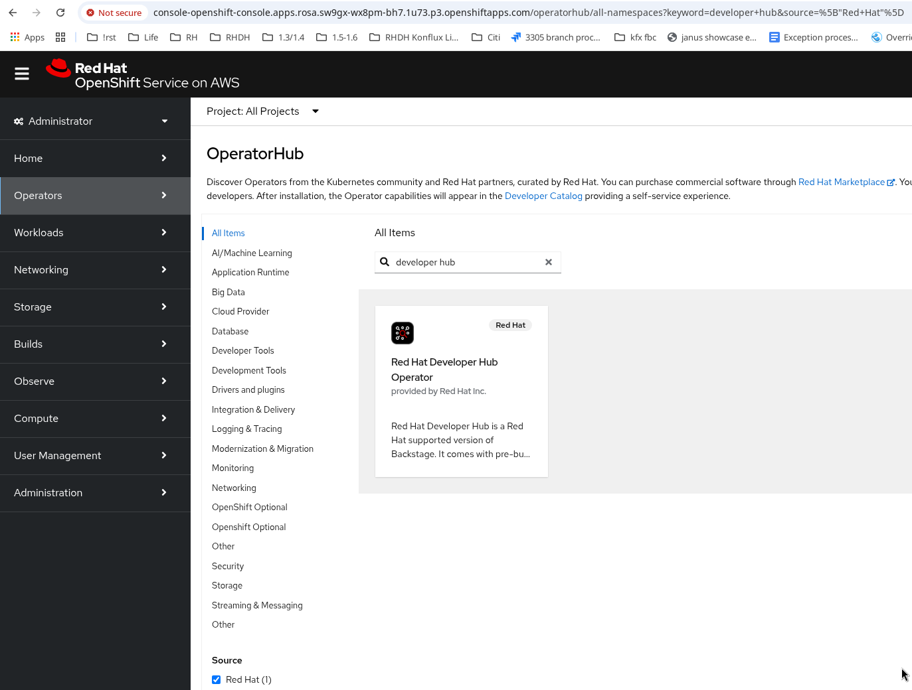
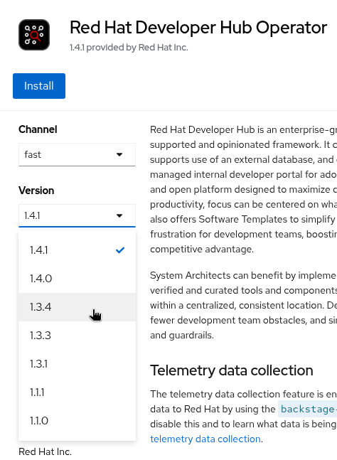
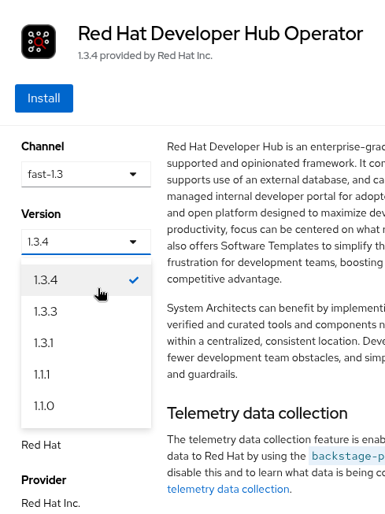

.. Helm Chart: smoke test the ability to:
... install latest chart
... upgrade to a newer chart - see link:https://github.com/rhdh-bot/openshift-helm-charts/tree/rhdh-1-rhel-9/installation[installation]
+
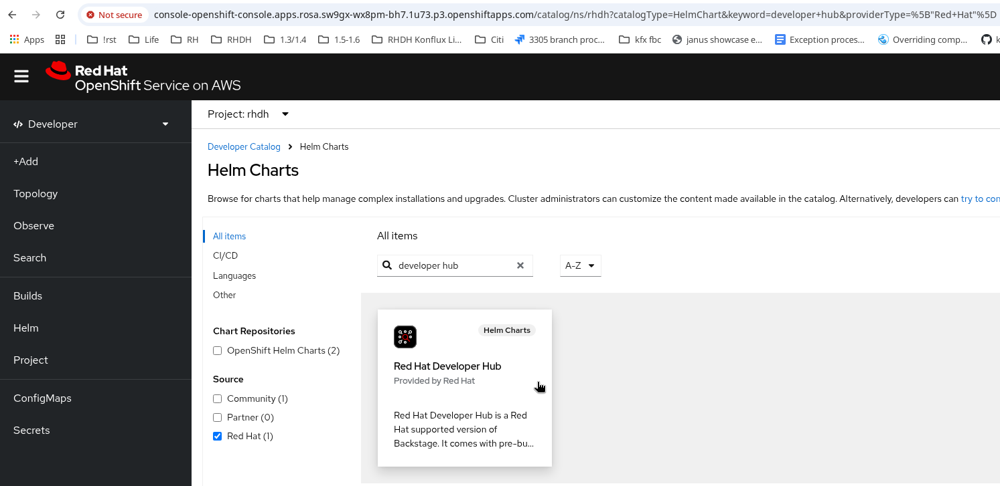
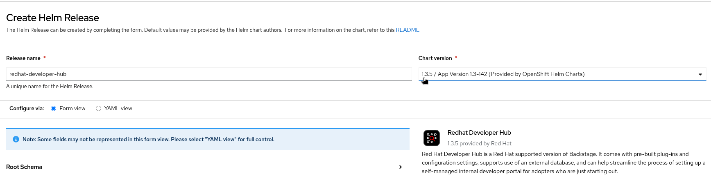

. Review websites
.. https://developers.redhat.com/
.. https://access.redhat.com/ (docs, other)
.. link:https://access.redhat.com[Customer portal]

. Check in with marketing re:
.. Internal announcement? External announcement? Other marketing / blogs / videos? Summit alignment / presentations?

=== [DOCUMENTATION] Notify docs team

. In the link:https://app.slack.com/client/E030G10V24F/C07EVRDD7KN[forum-rhdh-releases], update any existing threads about this release, and at-mention the `@rhdh-docs-gate-keeper` group so that Docs is aware they can release the doc updates. This may include the dynamic plugin lists, release notes, and any other queued fixes. 

. Release notes should be updated with a link to the latest RHBA or RHSA advisory. To find that link, use link:../build/scripts/getAdvisoryForCVE.sh[getAdvisoryForCVE.sh]. In future this may be done automatically. TODO: https://issues.redhat.com/browse/RHIDP-7886

=== [Release Manager] JIRA release

. If all the issues are resolved, close the JIRA releases
      * link:https://issues.redhat.com/projects/RHIDP?selectedItem=com.atlassian.jira.jira-projects-plugin%3Arelease-page&status=released-unreleased[RHIDP]
      * link:https://issues.redhat.com/projects/RHDHBUGS?selectedItem=com.atlassian.jira.jira-projects-plugin%3Arelease-page&status=released-unreleased[RHDHBUGS]

.. If not, go chase people or ask the `@rhdh-release-manager` to chase them

.. If you don't have permission to update JIRA, please message the `@rhdh-release-manager` group in Slack for help.

=== [SUPPORT] Comet updates

. If this is a .0 release, remove the now-EOL image stream from Comet so we stop getting reminded about CVEs for EOL versions. For example with the release of `1.y`, `1.(y-2)` is EOL; remove `1.(y-2)` and add `1.(y+1)` to the list. 
+
See image metadata at https://comet.engineering.redhat.com/containers/repositories?view=myRepos&filter=repoPath:rhdh then click through on each image to edit them.
* https://comet.engineering.redhat.com/containers/repositories/645bd4c15c00598369c31aba
* https://comet.engineering.redhat.com/containers/repositories/64bfdcd740aa90644e579cbd
* https://comet.engineering.redhat.com/containers/repositories/64bfdcd740aa90644e579cc6
+
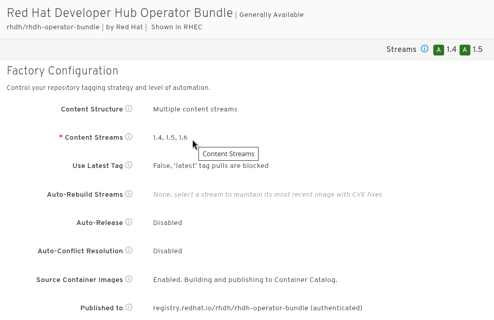

TODO: Starting in 1.9, do we also need to do Comet updates for the plugins? 

=== [Quay] Clean up old tags in the Quay repositories
. If this is a .0 release, run link:../build/scripts/deleteTagsFromQuay.sh[deleteTagsFromQuay.sh] script to clean up old tags for previous releases.
. Or trigger the weekly maintenance pipeline at https://gitlab.cee.redhat.com/rhidp/rhdh/-/pipeline_schedules
+
----
./build/scripts/deleteTagsFromQuay.sh --help   # get help, token export instructions, and options
# remove tags older than 4mo old, from the y-3 release (if latest stable GA is 1.8, clean up the 1.5 tags)
export accessToken=... # use --help flag for instructions on how to generate a token

old_version=1.y-3 # for example, remove 1.5 when releasing 1.8
./build/scripts/deleteTagsFromQuay.sh --filter "${old_version}-" --age '4 months' --debug
...
Repo rhdh-hub-rhel9 processed to page 1; tags deleted: 100
Repo rhdh-rhel9-operator processed to page 1; tags deleted: 82
Repo rhdh-operator-bundle processed to page 1; tags deleted: 100
Repo iib processed to page 1; tags deleted: 72
...
Total tags deleted: 354
----
* You may need to run the script a few times to delete all the old tags. Keep running until you see: `Repo ... processed to page 0; tags deleted: 0`. You can also re-run it for older tags (eg., 1.3-, 1.4-) if those are entirely EOL.

== Other considerations

Ongoing through the quarter, remember to:

. Update the link:../build/containerfiles/[gitlab pipeline runner images] at least once every quarter
. Monitor GH-GL syncs and pipelines, as things can fail unexpectedly on gitlab runners
. Monitor quay image updates to ensure everything is kept current and fresh relative to upstream branches
. Monitor new OCP release dates - add a new Application and Component for the new FBC in Konflux - see link:RHDH-Konflux-overview-onboarding.adoc[RHDH-Konflux-overview-onboarding]
. Monitor OCP EOL dates - delete old FBC Applications from Konflux to stop building for that OCP version (link:https://issues.redhat.com/browse/RHIDP-9064[RHIDP-9064]) - see link:RHDH-Konflux-overview-onboarding.adoc[RHDH-Konflux-overview-onboarding] 

---

=== Release Process Summary
|===
| **Step** | **Key Actions & Required Scripts** | **Responsible Team**

| **1. Feature Freeze / Branch Creation** | For Feature Freeze of an upcoming .0 release, run https://gitlab.cee.redhat.com/rhidp/rhdh/-/blob/rhdh-1-rhel-9/build/scripts/tagRelease.sh[tagRelease.sh]:
`export GITHUB_TOKEN=<rhdh_bot_GH_token>` +
`./build/scripts/tagRelease.sh -t 1.y --branchfrom main -gh release-1.y`
+
This script creates link:https://github.com/redhat-developer/rhdh/branches/all?query=release-[release-1.y] and link:https://gitlab.cee.redhat.com/rhidp/rhdh[rhdh-1.y-rhel-9] branches and updates `main`.
+
Once everything is merged, link:https://gitlab.cee.redhat.com/rhidp/rhdh/-/pipeline_schedules[create a new GL pipeline] for the new stable branch. | Release Engineering

| **2. Code Freeze** | For .0 releases, ensure all changes are merged. Reject non-blocker requests and route them to PM/QE/Docs. Test/documentation plans must be locked. 

For .z updates, verify that all announced fixes have been merged and built. 

In both cases, ensure that base images have been updated to the latest possible tags in the branch from which you're building. Run the sync-midstream.sh to pin the latest RPMs too.

Verify that the hub and operator repos' latest commits have been built, and that the operator bundle contains the correct latest images. | Release Engineering

| **3. Build & Test** | Tekton Pipelines for builds are triggered automatically when commits happen in the upstream GH repos, if the GL pipeline is enabled and changes are found. File Based Catalog fragments (FBCs) must be built by hand at intervals (see link:https://issues.redhat.com/browse/RHIDP-5888[RHIDP-5888] and link:https://issues.redhat.com/browse/RHIDP-6305[RHIDP-6305]). Update link:../.tekton/[Tekton pipelines] regularly with link:../.tekton/updateDigests.sh[updateDigests.sh]. | QE, Engineering, Release Engineering

| **4. Release Candidate (RC)** | 
1. **Disable scheduled pipelines** to prevent unapproved changes:  
Go to link:https://gitlab.cee.redhat.com/rhidp/rhdh/-/pipeline_schedules[pipeline schedules], uncheck *Activated*, and save changes.

2. Run link:../build/scripts/updateBaseImages.sh[updateBaseImages.sh] against the upstream repos link:https://github.com/redhat-developer/rhdh/[rhdh] and link:https://github.com/redhat-developer/rhdh-operator/[rhdh-operator] to update base images in containerfiles.

3. Update link:../.tekton/[Tekton pipeline task versions] using link:../.tekton/updateDigests.sh[updateDigests.sh].

4. If needed, **spin a new operator-bundle build**. 

5. **Update the FBCs** using https://gitlab.cee.redhat.com/rhidp/rhdh/-/blob/rhdh-1-rhel-9/build/scripts/renderCatalogs.sh[renderCatalogs.sh].

6. Verify FBC content. If replacements are incorrect, modify `catalog-template.json` and rerun the script. **NOTE**: if multiple releases are in flight, remember to re-render FBCs after each GA push in order to not accidentally delete freshly released operators. 

7. Release containers to stage.

8. Notify team about RC via slack and email.
| Release Engineering, PM, QE

| **5. GA Preparation** | Update documentation and release notes.
+
Check PRs for Release Notes: link:https://github.com/redhat-developer/red-hat-developers-documentation-rhdh/[RHDH Docs Repo].
+
Run update scripts:
`./modules/dynamic-plugins/rhdh-supported-plugins.sh` +
`./modules/release-notes/single-source-release-notes.py`
+
Notify QE and Security for final validation. | Security, Docs, QE

| **6. GA Release** | **Container release:**
+
`./build/scripts/kfuxRelease.sh --prod -c rhdh-operator-bundle:1.y-zzz -v 1.y.z --cve /tmp/RHDH\ CVE\ Management\ -\ 1.y.z.csv`

**Helm Chart PR generation:**
+
`./build/helm/prepare.sh --chart-version 1.y.z --rhdh-version 1.y.z --chart-branch release-1.y --publish`

**FBC re-rendering:**
+
`./build/scripts/renderCatalogs.sh --rhec ...`

**FBC release:**
+
`./build/scripts/kfuxRelease.sh --prod --fbc :1.y.z [--debug] [--auto]`

**Repository tagging & updates:**
+
`export GITHUB_TOKEN=rhdh-bot-token-goes-here` +
`./build/scripts/tagRelease.sh -v 1.y.z -t 1.y -gh release-1.y --midstream-branch rhdh-1.y-rhel-9 --clean --force-update --nobuild` | Release Engineering

| **7. Post-Release** | 

Verify new tag is available in link:https://quay.io/repository/rhdh-community/rhdh?tab=tags[quay.io/rhdh-community/rhdh] for use with rhdh-local.

Smoke test install/update with Helm and Operator.

Notify CCS that the doc .0 release or .z update can go live.

Update link:../build/containerfiles[pipeline runner containerfiles] **at least once per quarter**. 

For a .0 release, **Delete EOL versions** from Comet: link:https://comet.engineering.redhat.com/containers/repositories?view=myRepos&filter=repoPath:rhdh[Comet] and delete old FBC Applications from Konflux.
| Release Engineering
|===
