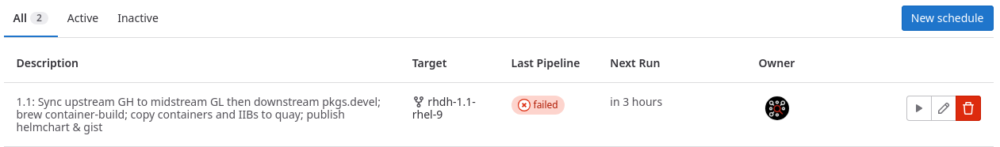
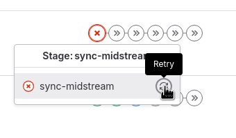
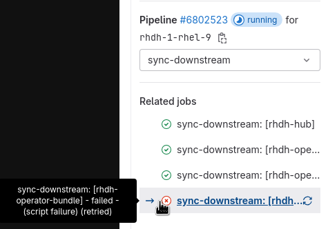

# How to build with Gitlab

## [DEPRECATED] How to release a plugin from the release-1.yy branch

If you need to release a plugin manually from the stable branch (not main) see https://gitlab.cee.redhat.com/rhidp/rhdh/-/blob/rhdh-1-rhel-9/build/scripts/releasePlugin.sh[build/scripts/releasePlugin.sh].

Once released, you can then update the redhat-developer/rhdh package.json files, which will in turn trigger an update to the midstream repo.

See also https://issues.redhat.com/browse/RHIDP-2525

## How to respin because of a change upstream 

. Push a change to either of the link:https://gitlab.cee.redhat.com/rhidp/rhdh/-/blob/rhdh-1-rhel-9/upstream_repos.yml[upstream repos] - make sure you're pushing to the correct branch for the downstream sync.
    ** https://github.com/redhat-developer/rhdh
    ** https://github.com/redhat-developer/rhdh-operator

. Wait until the next scheduled build (runs every 3 or 4 hours) or trigger a pipeline job from the link:https://gitlab.cee.redhat.com/rhidp/rhdh/-/pipeline_schedules[Pipeline Schedules] page using the play icon:



## How to respin because of a change midstream 

. You can also trigger a build by pushing a commit into link:https://gitlab.cee.redhat.com/rhidp/rhdh/[the rhidp/rhdh repo], but if there is no change upstream, the job will not rebuild the containers. 

. To **force** a rebuild from the midstream without changing upstream, empty the appropriate file (of files) in the link:https://gitlab.cee.redhat.com/rhidp/rhdh/-/tree/rhdh-1-rhel-9/sync[sync] folder, or run link:../build/scripts/triggerRespin.sh[triggerRespin.sh].

## Pipelines

Watch the following places:

* link:https://gitlab.cee.redhat.com/rhidp/rhdh/-/pipelines[Gitlab pipelines]
* link:https://konflux.apps.stone-prod-p02.hjvn.p1.openshiftapps.com/application-pipeline/workspaces/rhdh/applications[Konflux pipelines]

### Gitlab Pipeline Stages

The link:https://gitlab.cee.redhat.com/rhidp/rhdh/-/tree/rhdh-1-rhel-9/build/ci[stages in the Gitlab pipeline] are as follows:

. sync upstream repos to midstream
** this will also run a yarn build in the rhdh-hub folder to regenerate dynamic plugin content and package.json files
. commit changes, which triggers Konflux pipelines

### Konflux Pipeline Stages

If any of the files in the `on-cel-expression` of a link:https://gitlab.cee.redhat.com/rhidp/rhdh/-/blob/rhdh-1-rhel-9/.tekton/rhdh-hub-1-push.yaml#L10[.tekton/*.yaml] file are changed, an `on-push` build will run. 

For merge requests against the midstream GL repos, ANY change within the PR (adding a commit, replacing a commit) will re-trigger an `on-pull` build. 

### What to watch out for

. Check the build log from the `sync-midstream` phase -- you should see something committed to the gitlab.cee repo if there was a change found and synced, or a merge conflict which will require triggering the build again

. If manually triggering a build you need to first rebuild the hub, operator, or both; then once done, trigger a bundle build: 
+ 
```
./build/scripts/triggerRespin.sh 1.5 hub # respin hub
./build/scripts/triggerRespin.sh 1.5 hub,op # respin hub and operator
./build/scripts/triggerRespin.sh 1.5 op # respin operator

# then once the above build(s) are done

./build/ci/sync-midstream.sh --bundleonly --force [--nopush] [--latest,--next] -b rhdh-1.5-rhel-9 # respin operator-bundle
```

. Once a new bundle appears on https://quay.io/repository/rhdh/rhdh-operator-bundle?tab=tags, you must **MANUALLY re-render the FBC catalogs** with link:https://gitlab.cee.redhat.com/rhidp/rhdh/-/blob/rhdh-1-rhel-9/build/scripts/renderCatalogs.sh#L66[`renderCatalogs.sh`]. This should take about 2 mins per OCP version, and the builds in Konflux should take 5-10 mins total. Whole step should be under 20 mins. 
+
TODO: automate this -- see link:https://issues.redhat.com/browse/RHIDP-5888[RHIDP-5888] and link:https://issues.redhat.com/browse/RHIDP-6305[RHIDP-6305].
+
```
oc login --token=... # log into the https://console-openshift-console.apps.stone-prod-p02.hjvn.p1.openshiftapps.com/k8s/cluster/projects/rhdh-tenant cluster

git checkout rhdh-1.4-rhel-9
RHDH_VERSION="1.4.2"
for OCP_VERSION in 4.14 4.15 4.16 4.17 4.18; do \
  time ./build/scripts/renderCatalogs.sh --versions "${OCP_VERSION}" -v "${RHDH_VERSION}" [--latest, --next] \
    --template "catalogs/v${OCP_VERSION}/catalog-template.json"; sleep 30s; \
done
```
+
. If there was a change to hub then there should also be a new link:https://quay.io/repository/rhdh/chart?tab=tags[helm chart created], using the same image tag.

## Retry a failed build

If you want to rebuild from a failed stage, you can do that from the pipelines page:



Once retried, the list of builds for a given stage will identify the retried build:


