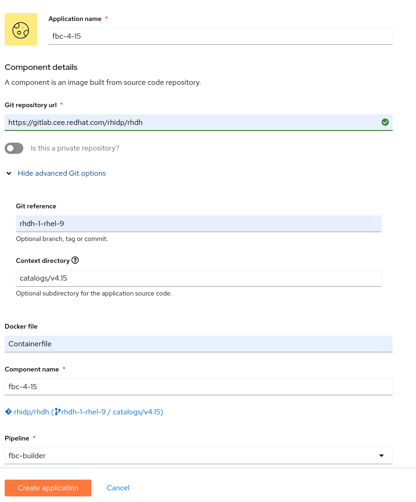

# Building and Testing with RH Internal Konflux

## Onboarding a new person

1. Ask that person to go to https://konflux.apps.stone-prod-p02.hjvn.p1.openshiftapps.com/application-pipeline/workspaces/rhdh/applications
2. Ask that person to log in, register, click "join the waitlist", refresh their browser
3. Ask that person for their username / default workspace. This is likely their kerberos username, but might differ.
4. Add that person here: https://konflux.apps.stone-prod-p02.hjvn.p1.openshiftapps.com/application-pipeline/access
5. Once added, you can change their access level to contributor, maintainer, or admin. 

## Triggering builds

1. Push a commit to the https://gitlab.cee.redhat.com/rhidp/rhdh repo
* For the rhdh-1 branch (CI ONLY), watch builds here: https://konflux.apps.stone-prod-p02.hjvn.p1.openshiftapps.com/application-pipeline/workspaces/rhdh/applications/rhdh-1
* For other branches, see the appropriate application: https://konflux.apps.stone-prod-p02.hjvn.p1.openshiftapps.com/application-pipeline/workspaces/rhdh/applications

## Adding a new Application and Component to build FBCs for a new OCP version

1. Go to ## Adding a new Application and Component to build FBCs for a new OCP version

2. Create a new Application and Component:

## Removing support for EOL OCP versions

1. Delete the fbc application

2. Update lifecycle docs & official product docs, release notes, etc. 

## Installation

### Helm

TODO: write this

### Operator

TODO: write this

* install an IDMS/ICSP to resolve container image references
* install the latest FBC as a CatalogSource

See also:
* https://konflux.pages.redhat.com/docs/users/getting-started/building-olm-products.html#testing-a-fbc-graph
* https://github.com/redhat-developer/rhdh-operator/blob/main/.rhdh/scripts/install-rhdh-catalog-source.sh (needs revision)

## GA Releases

TODO: write this

