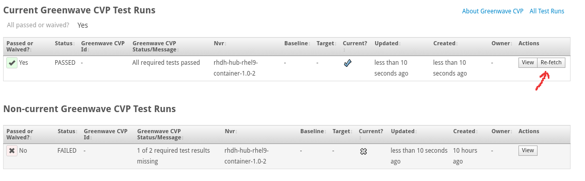
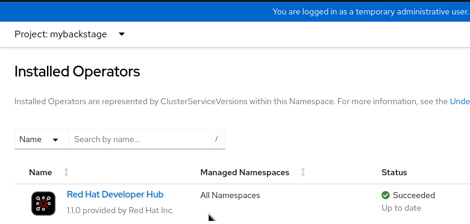
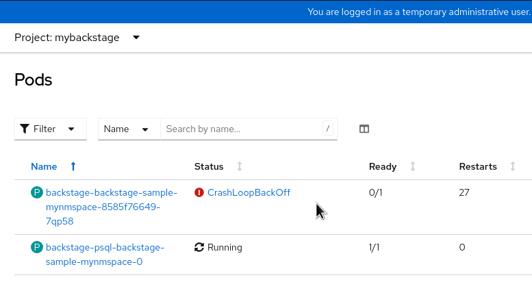
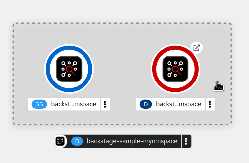

 # Productization Documentation

## Purpose

This repo seeks to document how to productize the following products:

* Red Hat Developer Hub (RHDH) - container image, operator/bundle, and helm chart

## Where things go

## Project tracking

We use GitHub issues for upstream, link:https://issues.redhat.com/browse/RHIDP[RHIDP JIRA] for downstream, and Errata for releases and security fixes.

* RHDH: https://errata.devel.redhat.com/product_versions/2002/variants/4330

### Upstream repos

. https://github.com/janus-idp/backstage-plugins (Collection of Backstage plugins, some of which are included in the RHDH hub container)
. https://github.com/redhat-developer/rhdh (community version, transformed to RHDH hub container downstream)
. https://github.com/redhat-developer/rhdh-operator (community version, link:https://github.com/redhat-developer/rhdh-operator/tree/main/.rhdh[transformed] to RHDH operator)
. https://github.com/redhat-developer/rhdh-operator/tree/main/bundle (community version, link:https://github.com/redhat-developer/rhdh-operator/tree/main/.rhdh[transformed] to RHDH operator-bundle container)

### Midstream and downstream repos

.  https://gitlab.cee.redhat.com/cpaas-products/product-configs/-/blob/main/rhdh/rhdh.yml (CPaaS version and list of admins)

. https://gitlab.cee.redhat.com/cpaas-products/rhdh/-/tree/main/versions/rhdh-1.0.0 (CPaaS & OSBS configuration)

. https://gitlab.cee.redhat.com/rhidp/rhdh/-/tree/rhdh-1.1-rhel-9/ (midstream)
** link:../distgit/[distgit/] - input to downstream builds
** link:../gcp_env/[gcp_env/] - product version definition
** link:../project.yml[project.yml] - CPaaS configuration to define how sources are transformed into downstream
** link:../.gitlab-ci.yml[.gitlab-ci.yml] - Gitlab CI pipeline definition and triggers
** link:../build/ci[build/ci] - Gitlab CI pipeline scripts, including link:build/ci/gitlab-co-env-setup.sh[gitlab environment setup]
** link:../sync/[sync/] -- stores SHAs of upstream repos to avoid unncessary builds
** link:../upstream_repos.yml[upstream_repos.yml] - definition of upstream repos and branches to use in sync.sh
** link:../upstream_sources.yml[upstream_sources.yml] - repo, branch, and SHA used for downstream https://issues.redhat.com/browse/RHIDP-518[by CPaaS] `(TODO)` does this even work?

. https://pkgs.devel.redhat.com/cgit/?q=rhdh (copies of midstream sources, used in downstream OSBS container builds)
.. https://pkgs.devel.redhat.com/cgit/containers/rhdh-hub/tree/?h=rhdh-1.1-rhel-9 
.. https://pkgs.devel.redhat.com/cgit/containers/rhdh-operator/tree/?h=rhdh-1.1-rhel-9 
.. https://pkgs.devel.redhat.com/cgit/containers/rhdh-operator-bundle/tree/?h=rhdh-1.1-rhel-9 

### Locations of CPaaS, HB, and other configuration files

* link:https://gitlab.cee.redhat.com/cpaas-products/rhdh/-/blob/main/versions/rhdh-1.0.0/[CPaaS configuration] - see both product.yml and release.yml files
* link:https://gitlab.cee.redhat.com/cpaas-products/rhdh/-/blob/main/versions/rhdh-1.0.0/[HoneyBadger configuration] - search for "honeybadger" fields in both product.yml and release.yml files
* link:https://gitlab.cee.redhat.com/rhidp/rhdh[OSBS midstream configuration for container builds] - includes link:https://gitlab.cee.redhat.com/rhidp/rhdh/-/tree/rhdh-1.1-rhel-9/distgit/containers/rhdh-hub[Dockerfile.in template], link:https://gitlab.cee.redhat.com/rhidp/rhdh/-/blob/rhdh-1.1-rhel-9/upstream_sources.yml[upstream_sources.yml], and yet another place to set link:https://gitlab.cee.redhat.com/rhidp/rhdh/-/blob/rhdh-1.1-rhel-9/gcp_env/product-version[version info]. Note that branch must be the same as the downstream repo, eg., `rhdh-1.1-rhel-9` (not `main`)


## How things run

Old way using link:RHDH-cpaas.adoc[CPaaS Jenkins] - for 0.x and 1.0

New way using link:RHDH-gitlab.adoc[Gitlab pipelines] - for 1.1+

### Building containers locally

To test a local change to the Dockerfile in Brew/OSBS without committing it first, you can either submit a link:https://gitlab.cee.redhat.com/rhidp/rhdh/-/merge_requests[MR] against the midstream repo's `.in` files in link:https://gitlab.cee.redhat.com/rhidp/rhdh/-/tree/rhdh-1.1-rhel-9/distgit/containers/rhdh-hub[distgit/containers/rhdh-hub], then wait for Jenkins to build that MR and generate a container downstream in Brew, or you can:

. First, get `devel` permission and install `brew` and `rhpkg` -- see link:https://gitlab.cee.redhat.com/rhidp/rhdh/-/blob/rhdh-1.1-rhel-9/docs/PERMISSIONS.adoc#user-content-devel-group[PERMISSIONS.adoc].

Then, clone the repo, create a topic branch, push that branch, and build a scratch build. If successful, you can then fetch the container image and run it to verify your changes were what you intended.

```
git clone ssh://<kerberosUser>@pkgs.devel.redhat.com/containers/rhdh-hub && cd rhdh-hub && git checkout rhdh-1.1-rhel-9
git branch private-kerberosUser-topic && git checkout private-kerberosUser-topic
# make your changes, then push them to the origin in your new branch

# once pushed, you can run scratch builds 
rhpkg container-build --target rhdh-1.1-rhel-9-containers-candidate --scratch
# this will spit out a taskID and a brewweb URL you can watch for detailed log output
# when complete the log will provide details about the container image and tag

# to kill a job, use 
brew cancel <taskID>
```

## Syncing 

### Syncing upstream to midstream

Sync pipelines currently run every 4 hrs, but can be triggered by hand too.

* https://gitlab.cee.redhat.com/rhidp/rhdh/-/pipelines 
* https://gitlab.cee.redhat.com/rhidp/rhdh/-/pipeline_schedules

Sync from upstream to midstream (this repo) is done using the following files:

** link:../distgit/[distgit/] - input to downstream builds
** link:../gcp_env/[gcp_env/] - product version definition
** link:../project.yml[project.yml] - CPaaS configuration to define how sources are transformed into downstream
** link:../.gitlab-ci.yml[.gitlab-ci.yml] - Gitlab CI pipeline definition and triggers
** link:../build/ci[build/ci] - Gitlab CI pipeline scripts, including link:build/ci/gitlab-co-env-setup.sh[gitlab environment setup]
** link:../sync/[sync/] -- stores SHAs of upstream repos to avoid unncessary builds
** link:../upstream_repos.yml[upstream_repos.yml] - definition of upstream repos and branches to use in sync.sh

====
NOTE: Upstream and midstream branch is subject to change; `main` branch will be reserved for bleeding edge, not productized content. If/when these lists change, please remember to update link:https://product-security.pages.redhat.com/offering-registry/offerings/red-hat-developer-hub/ssml/SSML.PS.1.1.1/[SSML.PS.1.1.1 evidence] `(TODO)`.
====

### Syncing midstream to downsteam

CPaaS is supposed to handle this, but seems to be broken.

See link:../upstream_sources.yml[upstream_sources.yml] - definition of upstream repos and branches link:../upstream_sources.yml.README[used by CPaaS to handle downstreaming] `(TODO)` https://issues.redhat.com/browse/RHIDP-518 does this even work?

Instead, link:../build/ci/sync-downstream.sh[] handles copying files from this repo to the downstream one.

## Releasing RHDH

### Developer Preview and CI builds

For pre-GA content, you can publish a brew build to quay like this:

. First, log into quay:
+
```
QUAY_REGISTRY="quay.io"
QUAY_USER="your-username"
QUAY_TOKEN="your-token-goes-here"
echo "[INFO]: Log into quay.io as ${QUAY_USER} ..."
echo "${QUAY_TOKEN}" | podman login -u="${QUAY_USER}" --password-stdin ${QUAY_REGISTRY} 
export QUAY_TOKEN
```
. Next, push the 1.1-yy image AND create additional floating tags for 1.1 and next (or latest)
+
```
./build/scripts/copyImageToQuay.sh registry-proxy.engineering.redhat.com/rh-osbs/rhdh-hub-rhel9:1.1-yy --pushtoquay="1.1 next"
```

CI builds (including link:https://quay.io/repository/rhdh/iib?tab=tags[IIBs]) are now published to Quay automatically every 4 hours:

Schedule: https://gitlab.cee.redhat.com/rhidp/rhdh/-/pipeline_schedules


#### Granting developer access

Builds will appear in a private repo such as 

* https://quay.io/repository/rhdh/rhdh-hub-rhel9?tab=tags
* https://quay.io/repository/rhdh/rhdh-rhel9-operator?tab=tags
* https://quay.io/repository/rhdh/rhdh-operator-bundle?tab=tags

To request access to the repo, send your quay username to one of these people to be added:
* nickboldt
* jfargett

#### Granting customer access

If you want to grant a customer access to the private repo(s), use this spreadsheet:

https://docs.google.com/spreadsheets/d/1Vl1CGZ74fMftSA5IPa7O6TvgOrBvKSyuiU94L7v4S6o/edit#gid=0

Then add their quay username(s) to this group:

https://quay.io/organization/rhdh/teams/customers


### Helm Chart

Prerequisites:

Actor must be included in the list of owners at link:https://github.com/openshift-helm-charts/charts/blob/main/charts/redhat/redhat/developer-hub/OWNERS[`charts/redhat/redhat/developer-hub/OWNERS`]. Otherwise their publishing attempt will be rejected.

CI builds (including link:https://github.com/rhdh-bot/openshift-helm-charts/tree/rhdh-1-rhel-9/installation/[install instructions]) are now published via link:https://gitlab.cee.redhat.com/rhidp/rhdh/-/pipeline_schedules[scheduled pipelines].

Build & PR generation process:

. Decide if a new version is due to be released because of helm chart changes or RHDH image changes.
. Review code in link:build/helm/[build/helm/]
.. Review `build/helm/Chart_patch.yaml` and `build/helm/values_patch.yaml` - check for errors or needed updates
. Run `build/helm/prepare.sh` script (consult `--help` if needed)
. Open a pull request against https://github.com/openshift-helm-charts/charts from your own fork. User opening the pull request must be listed as an owner. See prerequisites.

Chart is released and available to all OpenShift instances when the PR gets merge.

### Container image

This process is new and subject to change.

#### Downstream CI builds based on upstream changes

Old way using link:RHDH-cpaas.adoc[CPaaS Jenkins] - for 0.x and 1.0

New way using link:RHDH-gitlab.adoc[Gitlab pipelines] - for 1.1+

#### GA release

When you're ready to release the final RC / GA build:

* check that all the CVP tests have passed.

NOTE: If any CVP tests are missing, use the magical "Re-fetch" button to convince Errata to look again for the tests that might have completed AFTER the build was added to the Errata. This works about 99% of the time; for the other cases, an actual test failure occurred. Check for a CVP email with details; a respin may be required. 



* move the errata to QE state, then push the container(s) to stage
* have your content services associate (docs writer) approve the errata
* have your QA/QE associate approve the errata and move it to the REL_PREP state
* push to production should then happen automatically via generated SPCLOUD or CLOUDDST JIRA tickets.


### Operator and bundle images

Process should be the same as for building the hub container.

Note these changes to upstream content:

* upstream for the operator: 
  ** https://github.com/redhat-developer/rhdh-operator
  ** https://github.com/redhat-developer/rhdh-operator/tree/main/.rhdh/docker/Dockerfile

* upstream for the operator-bundle:
  ** https://github.com/redhat-developer/rhdh-operator/tree/main/bundle
  ** https://github.com/redhat-developer/rhdh-operator/tree/main/.rhdh

CI builds are now published to Quay automatically every 4 hours, including a new link:https://quay.io/repository/rhdh/iib?tab=tags[IIB] you can use as a CatalogSource to link:https://gitlab.cee.redhat.com/rhidp/rhdh/-/blob/rhdh-1-rhel-9/build/scripts/installCatalogSourceFromIIB.sh[install the latest or next build].

#### Operator installation 

. If you do not have a cluster already running, start a link:https://app.slack.com/client/E030G10V24F/D03GXSUT32A[Cluster Bot] instance, eg., with the command `launch 4.14 gcp` or `launch 4.14 aws`.
** Wait 30-40 mins for the cluster to be provisioned and login details to be provided in Slack.
** *NOTE*: The steps below (from Step 4) will not work properly on *hosted* clusters like link:https://hypershift-docs.netlify.app/[HyperShift] or link:https://www.redhat.com/en/blog/red-hat-openshift-service-aws-hosted-control-planes-now-available[ROSA with hosted control planes] due to a limitation preventing `ImageContentSourcePolicy` from being propagated to the cluster nodes. There is currently no workaround for these clusters. 
. Log into your cluster and get a login token
** From the top right corner menu of the admin console under your logged in user's name, select `Copy login command``, then click the `Display Token` link that opens in a new browser.
** Select the provided command and paste it into a console to run it
+
```
oc login --token=sha256~z6Whfzg3Q-Gy345vIAOd5f4ghhha5o0sgqgIRipgmcY --server=https://api.ci-ab-12345-678900.cluster-here.rhcloud.com:6443
```
+
. Log in to quay.io and registry.redhat.io, and use those tokens as pull secrets in your cluster -- see link:https://github.com/redhat-developer/rhdh-operator/blob/main/.rhdh/docs/installing-ci-builds.adoc[installing-ci-builds.adoc] for more on this and a scripted solution.
** Your user should have read permission for link:http://quay.io/rhdh[quay.io/rhdh] images
** If you don't, send your quay username to @nboldt in Slack to be added

. Run link:https://gitlab.cee.redhat.com/rhidp/rhdh/-/blob/rhdh-1-rhel-9/build/scripts/installCatalogSourceFromIIB.sh[installCatalogSourceFromIIB.sh]
+
```
./installCatalogSourceFromIIB.sh --next --install-operator rhdh
# or
./installCatalogSourceFromIIB.sh --iib quay.io/rhdh/iib:next-v4.14-x86_64 --install-operator rhdh
```
+ 
. The above script will:
** Create a `CatalogSource` from the IIB image
** Create an `ImageContentSourcePolicy` so references to internal registry or RH Ecosystem images will be found from link:http://quay.io/rhdh[quay.io/rhdh] instead
** Install the RHDH `Subscription` and `Operator`.
+
. Browse in your cluster's `Administrator` perspective to `Operators > Installed Operators`.
+

+
. Switch to the namespace you want to use for the Backstage instance, eg., `mybackstage`. 

. Select the operator to create a Backstage instance within your namespace:

. Wait as pods are rolled out. 

. You can either watch from `Workloads > Pods` view...
+

+
. Or switch to the `Developer` perspective and go to the `Topology` view.
+



## Who can help?

Can't find the doc/schema/example that would allow you to move to the next step? Has your JIRA request stalled out in a queue for several weeks? Been there. 

Some places that might help:

* link:https://mail.google.com/chat/u/1/#chat/space/AAAA-umhJ10[CPaaS Users] - to ask for help w/ CPaaS

* link:https://mail.google.com/chat/u/1/#chat/space/AAAAZrx3KlI[CVP] - for problems with the Container Verification Pipeline
* link:https://mail.google.com/chat/u/1/#chat/space/AAAAsaESYsw[exd-guild-rebuilds] - for problems with Freshmaker and CVE respins of containers or RPMs

* link:https://mail.google.com/chat/u/1/#chat/space/AAAANk3ECNM[SP Cloud Build] - Brew/OSBS and Cachito issues, including outages
* link:https://mail.google.com/chat/u/1/#chat/space/AAAAEj9A6Q8[SP Cloud Distribution] - publishing, IIBs/indexes/operator-bundle problems, product releases
* link:https://mail.google.com/chat/u/1/#chat/space/AAAAM8AsJ4k[SP Cloud Workflow] - if not a build or dist problem, try asking here
* link:https://mail.google.com/chat/u/1/#chat/space/AAAADRJzTIQ[exd-guild-hello-operator] - operator issues
* link:https://redhat-internal.slack.com/archives/C011HGCUCLV[#forum-helm] - Can help with RH Helm catalog issues
* link:https://rover.redhat.com/people/profile/jogonza[Jose Gonzalez] (Email: jogonza@redhat.com, Slack: `@jose`, GitHub: link:https://github.com/komish[@komish]) - Contact person for RH Helm catalog GitHub repository


## Reference material

See link:REFERENCES.adoc[links to useful docs & guides]
