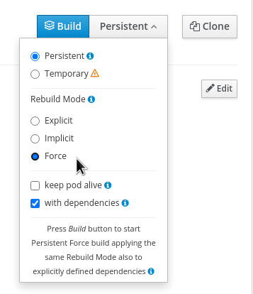
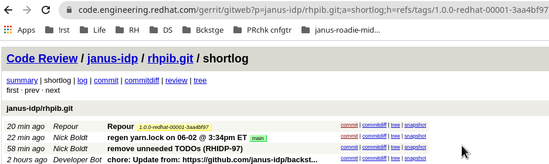

[NOTE]
====
RHPIB 2.0 is the last release of this product. As such, this doc is deprecated. 

If at some later date we decide to start publishing CLI apps to the RH NPM registry, this doc will be useful again, but will need to be refactored heavily.
 -- nboldt, Nov 17 2023
====

## Purpose

This repo seeks to document how to productize the following products:

* Red Hat Plug-ins for Backstage (RHPIB) - npm packages

## Where things go

## Project tracking

We use GitHub issues for upstream, link:https://issues.redhat.com/browse/RHIDP[RHIDP JIRA] for downstream, and Errata for releases and security fixes.

* RHIDP: https://errata.devel.redhat.com/product_versions/2008/variants/4341

### Upstream repos

* https://github.com/janus-idp/backstage-plugins/tree/bundle-2.0/
* https://github.com/RoadieHQ/roadie-backstage-plugins (using hardcoded SHAs, see midstream link:https://github.com/janus-idp/rhpib/tree/main/sync.sh[sync.sh] and link:https://github.com/janus-idp/rhpib/tree/main/plugins.yml[plugins.yml] for details)

### Midstream and downstream repos

*  https://gitlab.cee.redhat.com/cpaas-products/product-configs/-/blob/main/rhpib/rhpib.yml (CPaaS version and list of admins)

* https://gitlab.cee.redhat.com/cpaas-products/rhpib/-/tree/main/versions/rhpib-2.0.0 (CPaaS and PNC configuration)

* https://github.com/janus-idp/rhpib (midstream repo with upstream sources merged and transformed - see link:https://github.com/janus-idp/rhpib/tree/main/sync.sh[sync.sh] and link:https://github.com/janus-idp/rhpib/tree/main/plugins.yml[plugins.yml]). 

* https://code.engineering.redhat.com/gerrit/gitweb?p=janus-idp/rhpib.git;a=tree;h=refs/heads/main;hb=refs/heads/main (copy of midstream sources, used in downstream PNC builds)

====
NOTE: Upstream and midstream branch/SHA is subject to change. The `main` branch should be reserved for bleeding edge CI builds, not productized content. 
 
* Every time a new branch or SHA is needed to be fed to the build process, link:https://github.com/janus-idp/rhpib/tree/main/plugins.yml[plugins.yml] needs to be updated. See link:https://issues.redhat.com/browse/RHIDP-97[RHIDP-97] for more.

* If/when these lists change, please remember to update link:https://product-security.pages.redhat.com/offering-registry/offerings/red-hat-plug-ins-for-backstage/ssml/SSML.PS.1.1.1/[SSML.PS.1.1.1 evidence].
====

### Locations of CPaaS, HB, and other configuration files

* link:https://gitlab.cee.redhat.com/cpaas-products/rhpib/-/blob/main/versions/rhpib-2.0.0/[CPaaS configuration] - see both product.yml and release.yml files
* link:https://gitlab.cee.redhat.com/cpaas-products/rhpib/-/blob/main/versions/rhpib-2.0.0/[HoneyBadger configuration] - search for "honeybadger" fields in both product.yml and release.yml files
* link:https://gitlab.cee.redhat.com/cpaas-products/rhpib/-/blob/main/versions/rhpib-2.0.0/build-config.yaml[PNC build-config.yaml for yarn builds]
* link:https://gitlab.cee.redhat.com/cpaas-products/rhpib/-/blob/main/versions/rhpib-2.0.0/project.yml[PNC config]
* link:https://gitlab.cee.redhat.com/cpaas-products/rhpib/-/blob/main/versions/rhpib-2.0.0/upstream_sources.yml[CPaaS midstreaming config] - the SHA in this file SHOULD be updated automagically

====
WARNING: If the above upstream_sources.yml file is not being updated via CPaaS processes, then something is broken. 
====

====
NOTE: The link:https://cpaas.pages.redhat.com/documentation/schema/product/builds/pig.html#_staging_directory[staging directory] defined in your `product.yml` must be created via an link:https://issues.redhat.com/browse/SPMM-13347[SPMM ticket].
====

## How things run

### Jenkins orchestraton for PRs and pushes

Jenkins is used to coordinate all the builds, including triggering PNC builds of yarn artifacts for PIB and OSBS builds for RHDH containers. 

Some tasks are manual as the configuration changes infrequently; other tasks are automatic in response to upstream events. 

#### RHPIB links

. link:https://jenkins-cpaas-rhpib.apps.cpaas-poc.r6c9.p1.openshiftapps.com/job/pipeline-seed/[Pipeline seed] job - run every time a merge request is pushed to `cpaas-products`, or run *manually* for direct commits 

. link:https://jenkins-cpaas-rhpib.apps.cpaas-poc.r6c9.p1.openshiftapps.com/job/rhpib-2.0.0/job/honeyBadger-pipeline/[Honey Bager pipeline] - run *manually* for any changes to HB config in link:https://gitlab.cee.redhat.com/cpaas-products/rhpib/-/blob/main/versions/rhpib-2.0.0/product.yml[product.yml] or link:https://gitlab.cee.redhat.com/cpaas-products/rhpib/-/blob/main/versions/rhpib-2.0.0/release.yml[release.yml]

. link:https://jenkins-cpaas-rhpib.apps.cpaas-poc.r6c9.p1.openshiftapps.com/job/rhpib-2.0.0/[Build and release pipeline] jobs - run automatically for merges to upstream repos; may need to be run *manually* for some commits

. link:https://orch.psi.redhat.com/pnc-web/#/projects/1631/build-configs/11003[PNC job-config] - actual yarn builds inside PNC service, with artifacts

#### Troubleshooting

To force a repour of midstream sources into the gitlab mirror, you must:

. push a new SHA to midstream's link:https://gitlab.cee.redhat.com/cpaas-products/rhpib/-/blob/main/versions/rhpib-2.0.0/upstream_sources.yml[upstream_sources.yml], eg., link:https://gitlab.cee.redhat.com/cpaas-products/rhpib/-/commit/4926acc29c24af76d22428dfe3b063cd16fe9a78[4926acc29]
* manually trigger a build from:
.. link:https://jenkins-cpaas-rhpib.apps.cpaas-poc.r6c9.p1.openshiftapps.com/job/rhpib-2.0.0/job/build-pipeline/[Jenkins] (with parameter `force` = `true`) or 
.. link:https://orch.psi.redhat.com/pnc-web/#/projects/1631/build-configs/11177[PNC] (with `Rebuild Mode` = `Force`):

You should then see a new commit here:

https://code.engineering.redhat.com/gerrit/gitweb?p=janus-idp/rhpib.git;a=summary

Clicking through on the `shortlog` link, you can then see your latest midstream commit and a Repour commit:

https://code.engineering.redhat.com/gerrit/gitweb?p=janus-idp/rhpib.git;a=shortlog;h=refs/tags/2.0.0-redhat-00001-b489e34a

. _TODO: is there some other bit of magic required for this to work? Does https://jenkins-cpaas-rhpib.apps.cpaas-poc.r6c9.p1.openshiftapps.com/job/rhpib-2.0.0/job/poll-all-upstream-sources/ have to be run ?_ 

## Releasing RHPIB

This process is new and subject to change. Instead of a private GH repo, we may need to move to an internal GitLab repo to allow better automation.

### Downstream CI builds based on upstream changes

. Check for changes in https://github.com/janus-idp/backstage-plugins/commits/bundle-2.0 branch since the last build.
. Git clone the appropriate branch of https://github.com/janus-idp/rhpib
.. Run `./sync.sh;git rev-parse HEAD` to rebuild the yarn.lock, rebuild the plugins, commit changes, and get the new SHA -> `74a898111c81586cb175aa5edaa7e122469a9f26`
+
NOTE: there is a GH action for this - see link:https://github.com/janus-idp/rhpib/actions/workflows/sync.yml[sync.yml].

. Update `commit` in link:https://gitlab.cee.redhat.com/cpaas-products/rhpib/-/edit/main/versions/rhpib-2.0.0/upstream_sources.yml[rhpib-2.0.0/upstream_sources.yml] (see line 6) using the SHA from the above commit, and save changes. 
. Try a link:https://jenkins-cpaas-rhpib.apps.cpaas-poc.r6c9.p1.openshiftapps.com/job/rhpib-2.0.0/job/build-pipeline/[Jenkins build-pipeline job] - if it fails, see https://issues.redhat.com/browse/RHIDP-94
. *If the above Jenkins build failed*, run a link:https://orch.psi.redhat.com/pnc-web/#/projects/1631/build-configs/11177[forced build in PNC]
.. In either case the PNC job should automatically create a new commit via an link:https://orch.psi.redhat.com/pnc-web/#/projects/1631/build-configs/11177/builds/AZD43DXTMDAAA/alignment-log[alignment] step, which pushes a new link:https://code.engineering.redhat.com/gerrit/gitweb?p=janus-idp/rhpib.git;a=shortlog;h=refs/tags/2.0.0-redhat-00001-b489e34a[Repour] commit to the internal PNC SCM mirror.

Repeat the above steps for subsequent RC builds. 

### GA release

When you're ready to release and RC or GA build:

. Ensure the text-only Errata is in the correct state and both QE and Doc approvals have happened.

. Run link:build/scripts/stage-rhidp.sh[stage-rhidp.sh] to
.. link:https://spmm.pages.redhat.com/util-ansible/artifact-handoff.html#uploading-content-with-rsync[Copy artifacts from PNC] to rcm-guest/staging/rhpib/rhpib-x.y.z.yyyy-mm-dd link:https://download.devel.redhat.com/rcm-guest/staging/rhpib/[folder on spmm-util]
.. Run `link:https://spmm.pages.redhat.com/util-ansible/artifact-handoff.html#staging-a-snapshot-with-stage-mw-release[stage-mw-release]` command

. Notify SPMM/SPCloud person that the bits are ready to be released - see link:https://issues.redhat.com/browse/CLOUDDST-18988[CLOUDDST-18988]

## Who can help?

Can't find the doc/schema/example that would allow you to move to the next step? Has your JIRA request stalled out in a queue for several weeks? Been there. 

Some places that might help:

* link:https://mail.google.com/chat/u/1/#chat/space/AAAA-umhJ10[CPaaS Users] - to ask for help w/ CPaaS
* link:https://mail.google.com/chat/u/1/#chat/space/AAAARY5yy7A[PNC Users] - to ask for help w/ PNC

* link:https://mail.google.com/chat/u/1/#chat/space/AAAAEj9A6Q8[SP Cloud Distribution] - publishing, product releases
* link:https://mail.google.com/chat/u/1/#chat/space/AAAAM8AsJ4k[SP Cloud Workflow] - if not a build or dist problem, try asking here

## Reference material

See link:REFERENCES.adoc[links to useful docs & guides]
