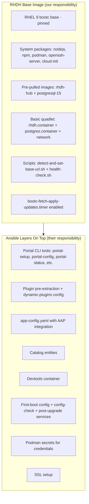

# RHDH BootC Base Image - Gap Analysis and Implementation Plan

**Date**: 2026-04-13
**Branch**: `feature/bootc-image-poc`
**Quay Repository**: `quay.io/rhdh/rhdh-bootc-rhel9` (already created)
**Ansible Reference**: [automation-portal-bootc-container](https://github.com/ansible-automation-platform/automation-portal-bootc-container)

---

## Scope Decision

**RHDH provides only the base image.** The Ansible team layers everything portal-specific on top.



### Ownership Boundaries

| Layer | Owner | Examples |
|-------|-------|---------|
| RHEL bootc image + hardening | RHDH | Base OS, SSH, system packages |
| RHDH hub + PostgreSQL images | RHDH | Pre-pulled into bootc storage |
| Basic quadlet definitions | RHDH | Generic rhdh.container, postgres.container, network |
| Base URL detection + health check | RHDH | detect-and-set-base-url.sh, health-check.sh |
| Automatic update timer | RHDH | bootc-fetch-apply-updates.timer |
| CI/CD pipeline | RHDH | Tekton/Konflux pipeline in rhidp/rhdh |
| Portal CLI tools | Ansible | portal-setup, portal-config, portal-backup, portal-restore, portal-status |
| Plugin management | Ansible | Plugin pre-extraction, dynamic-plugins config, OCI plugin tarballs |
| App configuration | Ansible | app-config.yaml with AAP integration, catalog entities |
| Deployment security | Ansible | Podman secrets, SSL setup, first-boot config |
| Support triage | Split | RHEL for Podman/OS, RHDH for base image, Ansible for plugins/appliance |

---

## Current POC Inventory and Review Status

The current POC on `feature/bootc-image-poc` includes content that needs to be reviewed to determine whether it belongs in the RHDH base image or should be provided by the Ansible team in their layer.

| Current POC File | Status | Notes |
|------------------|--------|-------|
| `Containerfile` | **Needs rewrite** | Needs hardening, pinning, pre-pull, review portal-specific setup |
| `build.sh` | **Needs fix** | References wrong filename (`Containerfile.bootc` instead of `Containerfile`) |
| `quadlet/rhdh.container` | **Needs review** | Review AAP-specific env vars; may need to be made more generic for base image |
| `quadlet/postgres.container` | **Needs review** | Review hardcoded passwords; may need to be made generic for base image |
| `quadlet/rhdh-network.network` | **Keep** | Already generic |
| `quadlet/rhdh.env` | **Needs review** | Review AAP/LLM/GitHub/GitLab vars; determine which belong in base vs Ansible layer |
| `quadlet/postgres.env` | **Needs review** | Review whether hardcoded values should be placeholder or removed for Ansible layer |
| `scripts/detect-and-set-base-url.sh` | **Keep** | Base-image responsibility per Jira |
| `scripts/prepare-and-install-dynamic-plugins.sh` | **Needs review** | Likely Ansible's responsibility -- review whether any part belongs in base image |
| `scripts/wait-for-plugins-and-start.sh` | **Needs review** | Likely Ansible's responsibility -- review whether any part belongs in base image |
| `configs/app-config/app-config.yaml` | **Needs review** | AAP-specific content; review whether a minimal base app-config is needed or if Ansible provides this entirely |
| `configs/catalog-entities/*` | **Needs review** | AAP-specific content; review whether Ansible should provide this entirely |
| `configs/dynamic-plugins/*` | **Needs review** | Plugin configuration; review whether Ansible should own this entirely |
| `configs/.npmrc.example` | **Needs review** | Review whether this belongs in base image or Ansible layer |
| `configs/extra-files/*` | **Needs review** | AAP-specific; review ownership |
| `local-plugins/` | **Needs review** | Review whether Ansible should own this entirely |
| `systemd/rhdh-stack-autostart.service` | **Keep/Simplify** | Useful for base image stack startup |
| `.gitignore` | **Keep** | `auth.json` exclusion |

---

## Gap 1: Containerfile Hardening

**Status**: NEEDS REWRITE -- current Containerfile is POC-quality.

The Containerfile needs to be rewritten to follow production patterns. The Ansible reference (`Containerfile.portal-bootc-quadlet`) demonstrates the target quality level.

### Key changes needed

| Aspect | Current POC | Target (from Ansible reference) | Action |
|--------|-------------|--------------------------------|--------|
| Base image | `registry.redhat.io/rhel9/rhel-bootc:latest` | `registry.redhat.io/rhel9/rhel-bootc:9.7-1775622314` | Pin to specific tag |
| Labels | None (appended by sync-midstream) | Full set with `ARG COMMIT_SHA` | Add proper labels |
| RPM management | Inline `dnf install` | `rpms.in.yaml` + `rpms.lock.yaml` + Cachi2 | Create lockfiles |
| Auth handling | `COPY ./auth.json` (baked in layer) | `--mount=type=secret,id=redhat-registry-secret` | Use build secrets |
| SSH security | `PermitRootLogin yes`, hardcoded passwords | `PermitRootLogin prohibit-password`, SSH keys only | Harden SSH |
| Image pre-pull | Symlinks in `bound-images.d/` only | `podman pull` into `/usr/lib/containers/storage` + `additionalimagestores` | Pre-pull images |
| Node.js module | Direct `dnf install nodejs` | `dnf module enable nodejs:22` + Cachi2 awareness | Add module enable |
| cloud-init | Not installed | Installed for cloud deployments | Add package |
| Image version stamp | None | `IMAGE_VERSION` file for upgrade reconciliation | Add version file |

### Proposed Containerfile structure

```dockerfile
FROM registry.redhat.io/rhel9/rhel-bootc:9.7-1775622314

ARG COMMIT_SHA="unknown"

LABEL vendor="Red Hat, Inc." \
      name="rhdh/rhdh-bootc-rhel9" \
      version="1.10" \
      summary="Red Hat Developer Hub Bootc Base Image" \
      description="RHEL Image Mode (bootc) base container for RHDH." \
      vcs-ref="${COMMIT_SHA}"

# System packages (Cachi2-aware for hermetic builds)
RUN if [ -f /cachi2/cachi2.env ]; then \
        . /cachi2/cachi2.env; \
    else \
        dnf module enable -y nodejs:22; \
    fi && \
    rpm --import /etc/pki/rpm-gpg/RPM-GPG-KEY-redhat-release && \
    dnf install -y nodejs npm python3 curl sudo podman openssl \
                   cloud-init open-vm-tools openssh-server && \
    dnf clean all

# Service account
RUN useradd -r -u 1001 -g root -d /opt/app-root/src -s /sbin/nologin rhdh && \
    mkdir -p /opt/app-root/src /etc/rhdh /var/lib/rhdh

# SSH: key-based auth only (NO hardcoded passwords)
RUN useradd -m -G wheel -s /bin/bash admin && \
    systemctl enable sshd && \
    printf '%s\n' \
      'PasswordAuthentication no' \
      'PermitRootLogin prohibit-password' \
      'PubkeyAuthentication yes' \
      > /etc/ssh/sshd_config.d/10-harden.conf

# Quadlet files
COPY quadlet/rhdh.container /usr/share/containers/systemd/rhdh.container
COPY quadlet/postgres.container /usr/share/containers/systemd/postgres.container
COPY quadlet/rhdh-network.network /usr/share/containers/systemd/rhdh-network.network

# Base scripts
COPY scripts/detect-and-set-base-url.sh /usr/local/bin/
COPY scripts/health-check.sh /usr/local/bin/
RUN chmod +x /usr/local/bin/*.sh

# Additional image store config
RUN sed -i -e '/additionalimage.*/a "/usr/lib/containers/storage",' \
        /etc/containers/storage.conf

# Pre-pull container images (air-gapped support)
ARG IMAGE_PULL_SECRET=redhat-registry-secret
RUN --mount=type=secret,id=${IMAGE_PULL_SECRET}/.dockerconfigjson \
    set -ex && \
    AUTH_FILE="/run/secrets/${IMAGE_PULL_SECRET}/.dockerconfigjson" && \
    podman --root /usr/lib/containers/storage pull --authfile "$AUTH_FILE" \
        registry.redhat.io/rhdh/rhdh-hub-rhel9:1.8 && \
    podman --root /usr/lib/containers/storage pull --authfile "$AUTH_FILE" \
        registry.redhat.io/rhel9/postgresql-15:latest && \
    find /usr/lib/containers/storage -maxdepth 2 -exec chmod a+rX {} +

# Enable automatic updates
RUN systemctl enable bootc-fetch-apply-updates.timer

# Image version stamp (for post-upgrade reconciliation by downstream)
RUN mkdir -p /usr/share/rhdh && \
    printf 'IMAGE_VERSION=1.10\nCOMMIT_SHA=%s\n' "${COMMIT_SHA}" \
    > /usr/share/rhdh/image-version

# Directories for downstream use
RUN mkdir -p /var/lib/rhdh/{dynamic-plugins-root,generated,config,.npm} && \
    mkdir -p /var/lib/rhdh/postgres-data && \
    chown 26:26 /var/lib/rhdh/postgres-data && \
    chmod 700 /var/lib/rhdh/postgres-data && \
    chown -R 1001:0 /opt/app-root /var/lib/rhdh /etc/rhdh

EXPOSE 7007 5432
CMD ["/usr/sbin/init"]

# append Brew metadata here
```

### Additional files to create

- `rpms.in.yaml` -- RPM dependency declaration for reproducible builds
- `rpms.lock.yaml` -- Generated lockfile (via `rpm-lockfile-prototype --bare rpms.in.yaml`)
- `argfile.conf` -- Build args file (`IMAGE_PULL_SECRET=redhat-registry-secret`)
- `rhel-9-baseos.repo` + `rhel-9-appstream.repo` -- For Cachi2 RPM resolution

---

## Gap 2: Quadlet Simplification

**Status**: Current quadlets include AAP-specific content that needs review.

### Proposed `rhdh.container` (generic base)

```ini
[Unit]
Description=Red Hat Developer Hub
After=network-online.target postgres.service
Wants=network-online.target
Requires=postgres.service

[Container]
Image=registry.redhat.io/rhdh/rhdh-hub-rhel9:1.8.5-1774545605
ContainerName=rhdh
PublishPort=7007:7007
User=1001:0
WorkingDir=/opt/app-root/src
Network=rhdh-network
HealthCmd=/bin/bash -c 'curl -f http://localhost:7007 >/dev/null 2>&1'
HealthInterval=30s
HealthTimeout=10s
HealthRetries=3

[Service]
ExecStartPre=+/usr/local/bin/detect-and-set-base-url.sh
Restart=always
RestartSec=15
TimeoutStartSec=900
TimeoutStopSec=300
KillMode=mixed

[Install]
WantedBy=multi-user.target default.target
```

### Proposed `postgres.container` (generic base)

```ini
[Unit]
Description=PostgreSQL Database for RHDH
After=network-online.target
Wants=network-online.target

[Container]
Image=registry.redhat.io/rhel9/postgresql-15:1-1771417730
ContainerName=rhdh-postgres
Volume=postgres-data:/var/lib/pgsql/data:Z
Network=rhdh-network
PublishPort=5432:5432
HealthCmd=/bin/bash -c 'pg_isready -U postgres'
HealthInterval=30s

[Service]
Restart=always
RestartSec=10
TimeoutStartSec=900

[Install]
WantedBy=multi-user.target default.target
```

The Ansible team adds environment variables, Podman secrets, volume mounts, and additional service directives when building their portal image `FROM` the RHDH base.

---

## Gap 3: Tekton/Konflux CI Pipeline

**Status**: NOT DONE -- pipeline files will be copied from the Ansible reference and adapted.

### Adaptation mapping

When copying `.tekton/automation-portal-bootc-main-push.yaml` from the Ansible repo:

| Field | Ansible Value | RHDH Value |
|-------|---------------|------------|
| `namespace` | `ansible-plugins-tenant` | `rhdh-tenant` |
| `appstudio.openshift.io/application` | `automation-portal-installer-main` | `rhdh-1` |
| `appstudio.openshift.io/component` | `automation-portal-bootc-main` | `rhdh-bootc-1` |
| `output-image` | `quay.io/redhat-user-workloads/ansible-plugins-tenant/...` | `quay.io/rhdh/rhdh-bootc-rhel9:{{revision}}` |
| `path-context` | `bootc/` | `distgit/containers/rhdh-bootc` |
| `dockerfile` | `Containerfile.portal-bootc-quadlet` | `Containerfile` |
| `on-cel-expression` paths | `bootc/***` | `distgit/containers/rhdh-bootc/***` |
| `serviceAccountName` | `build-pipeline-automation-portal-bootc-main` | `build-pipeline-rhdh-bootc-1` |

### Bootc-specific pipeline params to preserve

These are NOT present in standard RHDH hub/operator pipelines and must be kept:

- `privileged-nested: "true"` -- bootc images embed container images
- `build-platforms: [linux-root/amd64]` -- `linux-root/` prefix for privileged builds
- `activation-key: activation-key` -- RHEL subscription entitlement for dnf
- `additional-build-secret: redhat-registry-secret` -- for `--mount=type=secret` in Containerfile
- `hermetic: "false"` -- non-hermetic initially
- `buildah-remote-oci-ta` task (not standard `buildah-oci-ta`) -- 6h timeout, 6 CPU / 16Gi memory
- Pod security context: `privileged: true`, `runAsUser: 0`
- Pod annotations: `io.openshift.podman-fuse: ""`, `io.kubernetes.cri-o.Devices: /dev/fuse`

### Pipeline resource requirements

```yaml
taskRunSpecs:
  - pipelineTaskName: build-container
    computeResources:
      requests:
        cpu: 6
        memory: 16Gi
      limits:
        cpu: 6
        memory: 16Gi
timeouts:
  pipeline: 6h
```

### Additional pipeline integration

- Add bootc entry to `.tekton-templates/components.yaml`
- Generate push and pull variants
- Add `bootc` as a valid target in `build/scripts/triggerRespin.sh`

---

## Gap 4: Automation Script Updates

**Status**: PARTIALLY DONE

| Script | Status | Action |
|--------|--------|--------|
| `build/ci/sync-midstream.sh` | Done | Brew metadata, skip logic, license copying already integrated |
| `build/scripts/triggerRespin.sh` | Not done | Add `bootc` as a valid target |
| `distgit/containers/rhdh-bootc/build.sh` | Needs fix | References `Containerfile.bootc` instead of `Containerfile` |

---

## Gap 5: Konflux Onboarding (Manual Steps)

These are out-of-repo steps that must be performed in the Konflux tenant:

- [ ] Register `rhdh-bootc-1` Component under `rhdh-1` Application in `rhdh-tenant`
- [ ] Create service account `build-pipeline-rhdh-bootc-1`
- [ ] Create `activation-key` secret (RHEL subscription entitlement)
- [ ] Create `redhat-registry-secret` (for `--mount=type=secret` to pull images during build)
- [ ] Add Quay push secret for `quay.io/rhdh/rhdh-bootc-rhel9`
- [ ] Create pull-only robot account on Quay for Ansible team consumption

---

## Security Issues for SE Review

The following security concerns in the **current POC** need to be reviewed by SE Juan Perez de Algaba before the image can be considered production-ready. Items marked with a suggested fix reference the Ansible reference implementation pattern.

| # | Issue | Current State | Suggested Fix | Severity |
|---|-------|---------------|---------------|----------|
| 1 | Hardcoded passwords | `admin123` / `root123` via `passwd --stdin` | SSH-key-only auth (`PasswordAuthentication no`) | Critical |
| 2 | Root login enabled | `PermitRootLogin yes` | `PermitRootLogin prohibit-password` | Critical |
| 3 | Password auth enabled | Multiple `sed` commands enable password auth | `PasswordAuthentication no` in sshd_config.d | Critical |
| 4 | NOPASSWD sudo for wheel | `%wheel ALL=(ALL) NOPASSWD: ALL` | Scope down to specific commands | High |
| 5 | auth.json baked in layer | `COPY ./auth.json /etc/containers/auth.json` | `--mount=type=secret` (never persisted) | Critical |
| 6 | Floating base image | `registry.redhat.io/rhel9/rhel-bootc:latest` | Pin to specific tag+digest | High |
| 7 | Hardcoded DB passwords | In `.env` and `.container` files | Review: may be Ansible's concern in their layer | Medium |
| 8 | TLS verification disabled | `NODE_TLS_REJECT_UNAUTHORIZED=0` | Review: may be Ansible's concern in their layer | Medium |
| 9 | SELinux labels disabled | `SecurityLabelDisable=true` on both containers | Evaluate necessity | Medium |
| 10 | RHDH hub image unpinned | `rhdh-hub-rhel9:1.8` without digest | Pin with tag+digest | High |

**Reference**: [RHEL 9 Image Mode - Security Hardening and Compliance of Bootable Images](https://docs.redhat.com/en/documentation/red_hat_enterprise_linux/9/html-single/using_image_mode_for_rhel_to_build_deploy_and_manage_operating_systems/index#customizing-hardened-bootable-images_security-hardening-and-compliance-of-bootable-images)

---

## Priority Summary

| Priority | Task | Owner | Status |
|----------|------|-------|--------|
| **P0** | Review POC content for base vs Ansible layer split | RHDH | Pending |
| **P0** | Rewrite Containerfile (pin, harden, pre-pull, `--mount=type=secret`) | RHDH | Pending |
| **P0** | Copy + adapt Tekton pipeline from Ansible repo | RHDH | Pending |
| **P0** | Konflux onboarding (secrets, service account, component) | RHDH | Pending |
| **P1** | Simplify quadlet files to generic base | RHDH | Pending |
| **P1** | Security review by SE | RHDH + Juan | Pending |
| **P1** | Quay robot account for Ansible team | RHDH | Pending |
| **P2** | `triggerRespin.sh` + `build.sh` fixes | RHDH | Pending |
| **P2** | `rpms.in.yaml` + `rpms.lock.yaml` for reproducible builds | RHDH | Pending |

---

## Related Jira Issues

- [RHIDP-12339](https://redhat.atlassian.net/browse/RHIDP-12339) - Develop a Pipeline for Bootc & Quadlets
- [RHIDP-12340](https://redhat.atlassian.net/browse/RHIDP-12340) - Implement Image-Mode Update Lifecycle and Rollback Logic
- [RHIDP-12343](https://redhat.atlassian.net/browse/RHIDP-12343) - Create Configuration Validation Framework and Support Diagnostic Tools
- [RHIDP-12955](https://redhat.atlassian.net/browse/RHIDP-12955) - Create Private GitLab and Quay Repositories for BootC Image

## Related Repositories

| Repo | Access | Purpose |
|------|--------|---------|
| [automation-portal-bootc-container](https://github.com/ansible-automation-platform/automation-portal-bootc-container) | Private | Ansible's bootc container build (pipeline reference) |
| `rhidp/rhdh` (GitLab) | Private | RHDH midstream (where bootc base image lives) |
| `quay.io/rhdh/rhdh-bootc-rhel9` | Private | RHDH bootc image registry |
